# Lab1: Create CD Repoistory pipeline on GitHub

Learn how create repository CD on GitHub and working to preparing to Deploy pipeline to Azure.

After completing this lab, you'll be able to:

- Describe or explain how to design and implement CICD pipeline.


In this lab we use sample application that is named Tutorial API Backend and Tutorial Frontend we focus on Backend application to deploy on Azure appsevice (Webapp).

## Prerequisites

- <b>Requred lab Install GitHub Action Runner</b>
- <b>Workspace that required Software and Tools</b>
    - Git and GitHub Account
    - Text Editor (Required <b>Visual Studio Code</b>, or Visual Studio) [Visual Studio Code - Code Editing. Redefined](https://code.visualstudio.com/)

- <b>Infrastructures or Resources on Azure (Depend on before lab)</b>
    - Virtual Machine (Self-hosted Ubuntu)
    - Azure App service (Webapp support deploy code and dotnet6) 
    - Azure App service plan (Windows or Linux)
    - Azure Cosmos DB for MongoDB API ([Step for Initialize cosmos DB](./init-cosmos-db.md))
    - Azure Key Vault (if any)
    - Azure Application Insights (if any)

## 1. Create new Repository on GitHub

On GitHub <i>https://github.com/{username}</i> create new Repository named ```<username>-pipeline```

on the top right click New repository tab

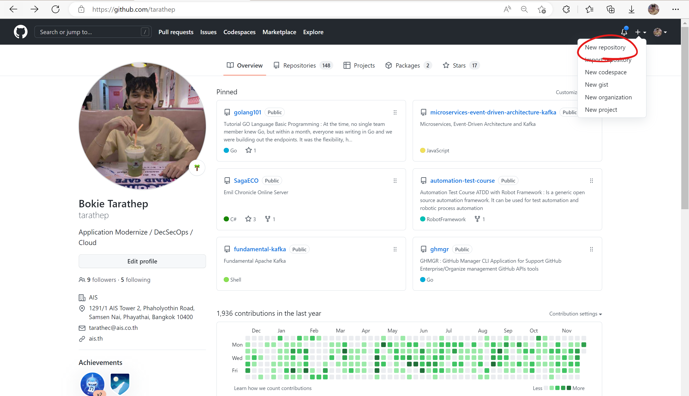

on page Create new repository selects in below

- Owner : `Username`
- Repository name : `<username>-pipeline`
- Description: Optional
- Public
- Initialze this repository with
    - Add a README.md file

init branch select main to default.

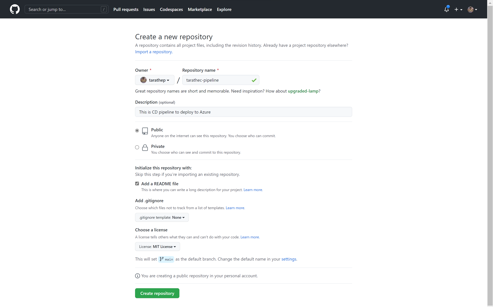

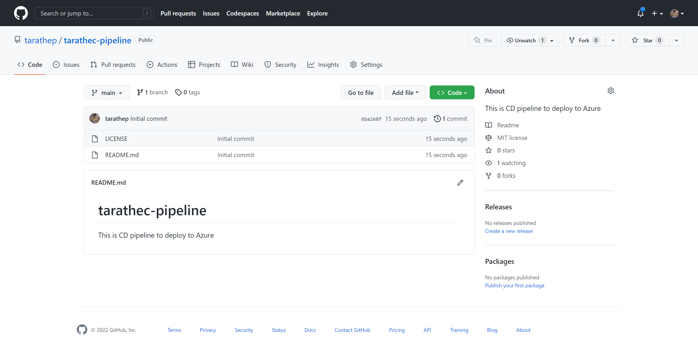

## 2. Connecting Repository with Self-hosted Runner on Azure

Go to the https://portal.azure.com on your resource please check the vm named `vm-<username>SelfHost-az-usw3-sbx-001`

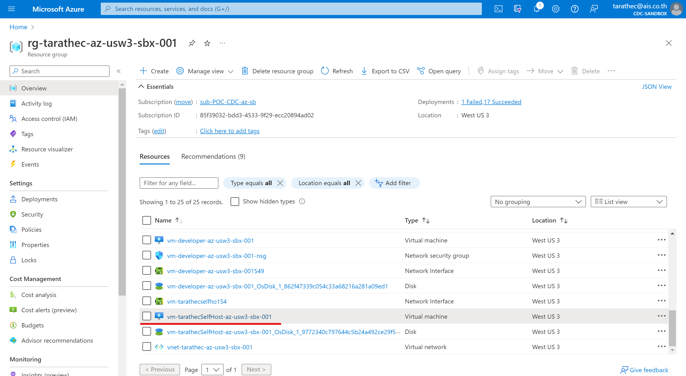

Connect with Bastion and enter

- Username : `Azureuser`
- Authentication Type : `SSH Private Key from Local File`
- Local file: `select private key to access`

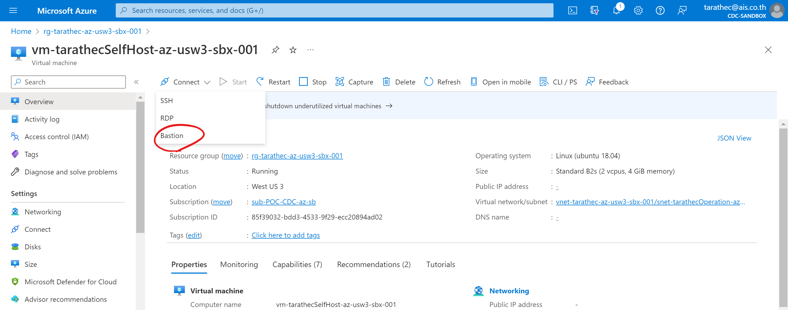

and then click Connect button.

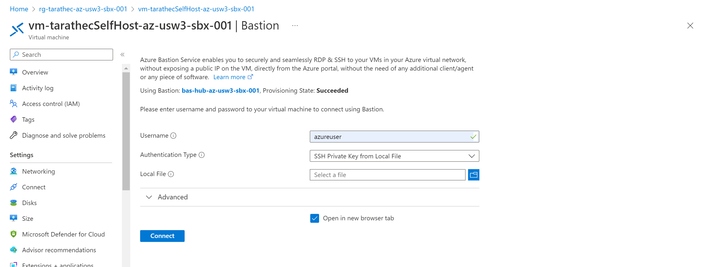

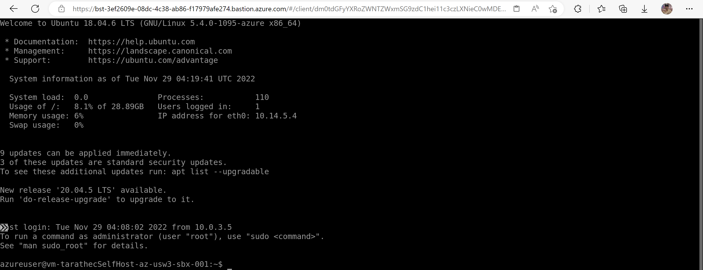

### Checking Install GitHub Self-hosted Runner

In the VM check the docker-compose.yml and .env already and conatainer has working.

```bash
cd github-runner-<username>
ls -al
```

you can see the docker-compose.yml and .env

check variables in .env and replace Token to connect with GitHub repository `<username>-pipeline`

```bash
cat .env
vi .env
```

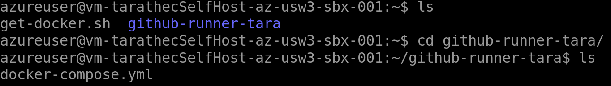

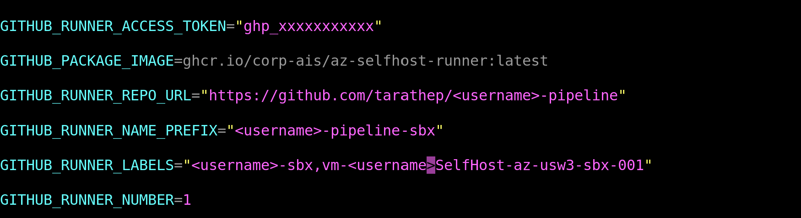


*If you don't self-hosted or not ready you must back to Day 3 | Networking on [Setup VM Self-hosted](https://mimotech.atlassian.net/wiki/spaces/CDC/pages/12863209535/Day+03+Labs+-+Networking+and+VM#Install-Self-hosted-Github-Runner) Labs*

When checking and edited and then docker compose again with command

```bash
docker compose down
docker compose up -d
```


 
*Inspects contaner runing use this command*

check contaier is running...

```bash
docker container ls
```

check docker compose apply on file

```bash
docker compose config
```

check container log

```bash
docker logs <container-name> -f
```

If everything is work go back to repository in settings > actions > runner

you can see self-hosted on Repos.

before
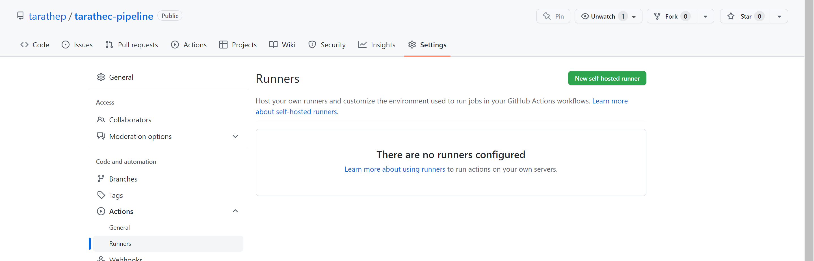

after
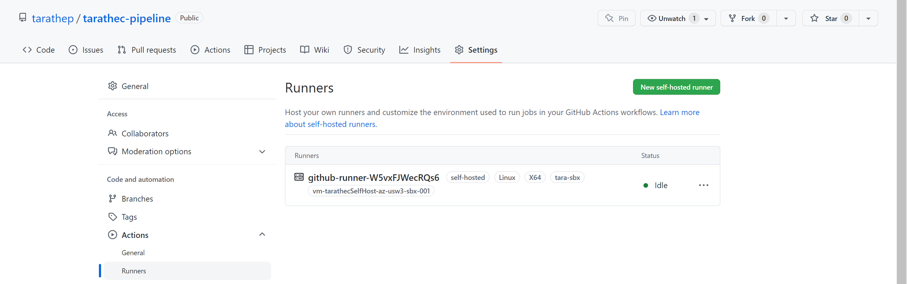
