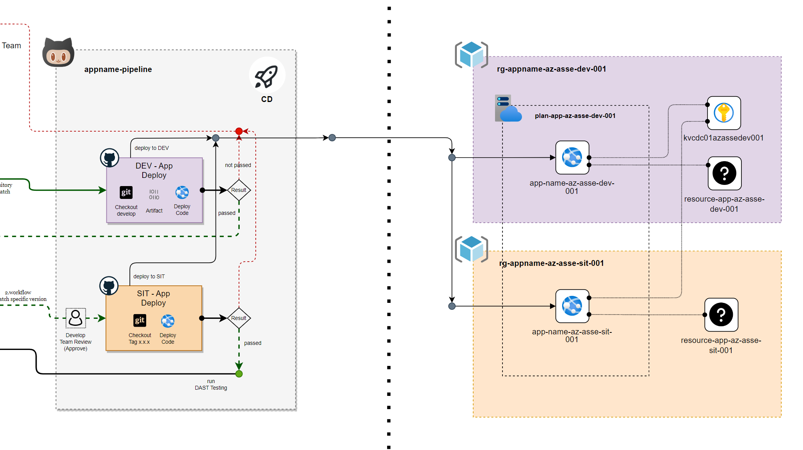

# Lab 2: Continuous Delivery/Deployment with GitHub Actions

Learn how continuous deployment or delivery application to Azure that working on GitHub Actions and implementation basic concepts.

After completing this lab, you'll be able to: 

- Explain and Implement CD workflows with GitHub Actions in fundamental.

- Explain Branching strategy working with each environment.

- Automation workflows and how to use Actions.

- Investigate and solvable working on pipeline.



## Prerequisites

- <b>Requred lab Install GitHub Action Runner</b>
- <b>Workspace that required Software and Tools</b>
    - Git and GitHub Account
    - Text Editor (Required <b>Visual Studio Code</b>, or Visual Studio) [Visual Studio Code - Code Editing. Redefined](https://code.visualstudio.com/)

- <b>Infrastructures or Resources on Azure (Depend on before lab)</b>
    - Virtual Machine (Self-hosted Ubuntu)
    - Azure App service (Webapp support deploy code and dotnet6)
    - Azure App service plan (Windows or Linux)
    - Azure Cosmos DB for MongoDB API ([Step for Initialize cosmos DB](./init-cosmos-db.md))
    - Azure Key Vault (if any)
    - Azure Application Insights (if any)

## Checking Resources Ready

On the Azure Spoke checking list belows
- app-<username>-az-usw3-dev-001
- app-<username>-az-usw3-sit-001
- id-<username>SelfHost-az-usw3-sbx-001
- mongo-<username>-az-usw3-sbx-001
- vm-<username>SelfHost-az-usw3-sbx-001


## Initialize GitHub workflow
Checkout the source code from GitHub ```github.com/<username>/<username>-pipeline```.

Open the terminal following command below

```bash
git clone https://github.com/<username>/<username>-pipeline.git
```

Open the project with text editor (Visual Studio Code) and create new folder named github/workflows in root directory of project (git).

```bash
mkdir .github/workflows
```


GitHub workflow is working on inside *.github/workflows* that contains GitHub workflows files that extension named .yaml

## Create DEV - App Deploy workflows

On Create DEV - App Deploy workflows is working on workflows CI Dev dispatch and automate deploy to Azure WebApp.


Create the new file named ```dev-tutorial-be-deploy.yml``` inside ```.github/workflows``` this on the Workflows Dev which contains 2 workflows: Build and DEV Deploy.


### Name

The first name starts with declare name of workflows

```yaml
name: DEV - App Deploy
```

### On (Events that trigger workflows)

Enter events when do you want to execute or trigger the workflows

you can see more of event type at [Events that trigger workflows - GitHub Docs](https://docs.github.com/en/actions/using-workflows/events-that-trigger-workflows)

```yaml
on:
  repository_dispatch:
    types: [<username>-tutorial-be-cd-dev]
  workflow_dispatch:
    inputs:
      ref:
        description: "Repository branch or tag"
        required: true
        default: "develop"
```

### Env

the environment global to declaration and variables

```yaml
env:
  REPOSITORY: "<username>/<username>-tutorial-backend"
  GITREF: ${{ github.event_name == 'repository_dispatch' && 'develop' || github.event.inputs.ref }}
  ARTIFACT_NAME: "artifact-tutorial-be-0.0.1-snapshot"
  APP_RESOURCE_NAME: app-<username>-az-usw3-dev-001
```

### Jobs

Groups together all the jobs that run in the DEV - App Deploy workflow.

```yaml
jobs:
...
```

#### build-app-service

The build artifact to contains in the job

```yaml
  build-app-service:
    name: Build
    runs-on: ubuntu-latest
    environment:
      name: dev
```

##### Steps

```yaml
    steps:
    - name: "Checkout project"
      uses: actions/checkout@v2
      with:
        repository: ${{ env.REPOSITORY }}
        ref: ${{ env.GITREF }}
        token: ${{ secrets.WORKFLOW_TOKEN }}
            
    - name: Setup .NET Core SDK
      uses: actions/setup-dotnet@v2.1.0
      with:
        dotnet-version: '6.0.x'

    - name: Install dependencies
      run: dotnet restore

    - name: Build
      run: dotnet build --configuration Release --no-restore
    
    - name: Pack Artifact
      run: cd Tutorial.Api/bin/Release/net6.0 && tar -zcvf ${{ env.ARTIFACT_NAME }}.tar.gz *

    - name: Upload Artifact
      uses: actions/upload-artifact@v3
      with:
        name: ${{ env.ARTIFACT_NAME }}
        path: '${{ github.workspace }}/Tutorial.Api/bin/Release/net6.0/${{ env.ARTIFACT_NAME }}.tar.gz'
```


Commit and push code to GitHub repository on main branch.


