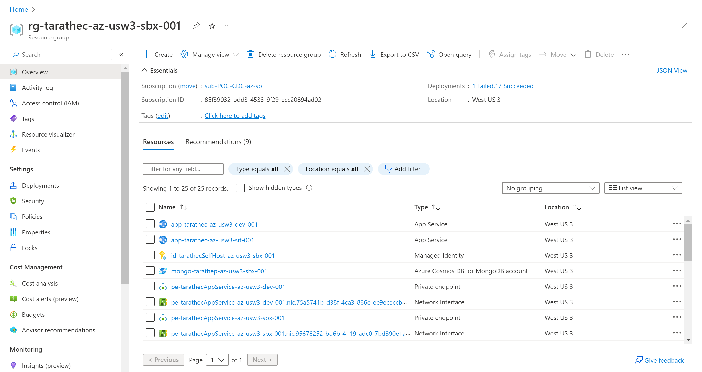
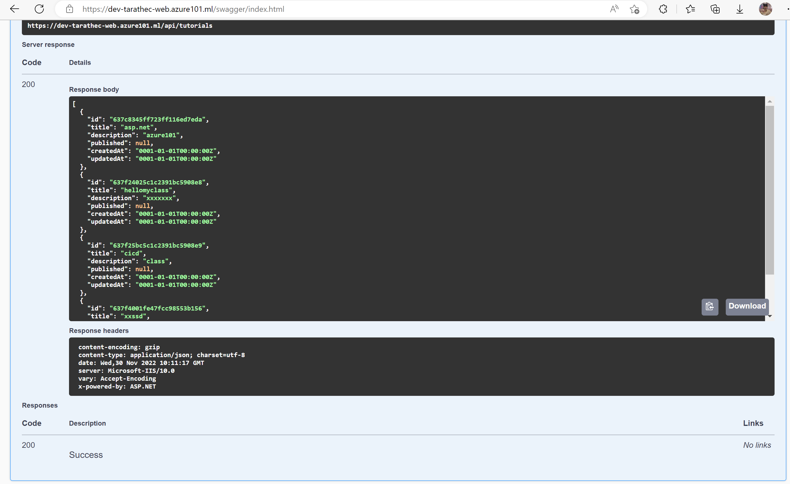

# Lab2: Implement workflows deploy to Appservice on DEV Environment


Learn how continuous deployment or delivery application to Azure that working on GitHub Actions and implementation basic concepts.

After completing this lab, you'll be able to: 

- Explain and Implement CD workflows with GitHub Actions in fundamental.

- Explain Branching strategy working with each environment.

- Automation workflows and how to use Actions.

- Investigate and solvable working on pipeline.


## Prerequisites

- <b>Required lab Install GitHub Action Runner</b>
- <b>Workspace that required Software and Tools</b>
    - Git and GitHub Account
    - Text Editor (Required <b>Visual Studio Code</b>, or Visual Studio) [Visual Studio Code - Code Editing. Redefined](https://code.visualstudio.com/)

- <b>Infrastructures or Resources on Azure (Depend on before lab)</b>
    - Virtual Machine (Self-hosted Ubuntu)
    - Azure App service (Webapp support deploy code and dotnet6)
    - Azure App service plan (Windows or Linux)
    - Azure Cosmos DB for MongoDB API ([Step for Initialize cosmos DB](./init-cosmos-db.md))
    - Azure Key Vault (if any)
    - Azure Application Insights (if any)

## Checking Resources Ready

On the Azure Spoke checking list below
- `app-<username>-az-usw3-dev-001`
- `app-<username>-az-usw3-sit-001`
- `id-<username>SelfHost-az-usw3-sbx-001`
- `mongo-<username>-az-usw3-sbx-001`
- `vm-<username>SelfHost-az-usw3-sbx-001`



## Initialize GitHub workflow

Checkout the source code from GitHub ```github.com/<username>/<username>-pipeline```.

Open the terminal following command below

```bash
git clone https://github.com/<username>/<username>-pipeline.git
```

Open the project with text editor (Visual Studio Code) and create new folder named `github/workflows` in root directory of project (git).

```bash
mkdir .github/workflows
```


GitHub workflow is working on inside *.github/workflows* that contains GitHub workflows files that extension named `.yaml`

## Create DEV - Tutorial BE Deploy workflows

On Create DEV - Tutorial BE Deploy workflows is working on workflows CI Dev dispatch and automate deploy to Azure WebApp.


Create the new file named ```dev-tutorial-be-deploy.yml``` inside ```.github/workflows``` this on the Workflows Dev which contains 2 workflows: Build and DEV Deploy.


### Name

The first name starts with declare name of workflows

```yaml
name: DEV - Tutorial BE Deploy
```

### On (Events that trigger workflows)

Enter events when do you want to execute or trigger the workflows

you can see more of event type at [Events that trigger workflows - GitHub Docs](https://docs.github.com/en/actions/using-workflows/events-that-trigger-workflows)

```yaml
on:
  repository_dispatch:
    types: [<username>-tutorial-be-cd-dev]
  workflow_dispatch:
    inputs:
      ref:
        description: "Repository branch or tag"
        required: true
        default: "develop"
```

### Env

the environment global to declaration and variables

```yaml
env:
  REPOSITORY: "<username>/<username>-tutorial-backend"
  GITREF: ${{ github.event_name == 'repository_dispatch' && 'develop' || github.event.inputs.ref }}
  ARTIFACT_NAME: "artifact-tutorial-be-0.0.1-snapshot"
  APP_RESOURCE_NAME: app-<username>-az-usw3-dev-001
```

### Jobs

Groups together all the jobs that run in the DEV - Tutorial BE Deploy workflow.

```yaml
jobs:
...
```

#### Build

The build artifact to contains in the job

```yaml
  build-app-service:
    name: Build
    runs-on: ubuntu-latest
    environment:
      name: dev
```

##### Steps

```yaml
    steps:
    - name: "Checkout project"
      uses: actions/checkout@v2
      with:
        repository: ${{ env.REPOSITORY }}
        ref: ${{ env.GITREF }}
        token: ${{ secrets.WORKFLOW_TOKEN }}
            
    - name: Setup .NET Core SDK
      uses: actions/setup-dotnet@v2.1.0
      with:
        dotnet-version: '6.0.x'

    - name: Install dependencies
      run: dotnet restore

    - name: Build
      run: dotnet build --configuration Release --no-restore
    
    - name: Pack Artifact
      run: cd Tutorial.Api/bin/Release/net6.0 && tar -zcvf ${{ env.ARTIFACT_NAME }}.tar.gz *

    - name: Upload Artifact
      uses: actions/upload-artifact@v3
      with:
        name: ${{ env.ARTIFACT_NAME }}
        path: '${{ github.workspace }}/Tutorial.Api/bin/Release/net6.0/${{ env.ARTIFACT_NAME }}.tar.gz'
```


Commit and push code to GitHub repository on main branch.

Go back to repository `<username>-pipeline` on tab Actions you can see workflow named ```DEV - Tutorial BE Deploy``` visible


before running this workflow, you must config variable secret at *Settings > Environments > dev*

if you don't found environment named ```dev``` you can click create New environment button and enter ```dev```


click on envionment ```dev``` name to set Environment secrets

Enter 

- Name: ```WORKFLOW_TOKEN```
- Value: ```ghp_xxxxxxxxxxxxxxxxx```


and go back to Actions tab and run workflows ```DEV - Tutorial BE Deploy```.


**Summary Code**

```yaml
name: DEV - Tutorial BE Deploy

on:
  repository_dispatch:
    types: [<username>-tutorial-be-cd-dev]
  workflow_dispatch:
    inputs:
      ref:
        description: "Repository branch or tag"
        required: true
        default: "develop"

env:
  REPOSITORY: "<username>/<username>-tutorial-backend"
  GITREF: ${{ github.event_name == 'repository_dispatch' && 'develop' || github.event.inputs.ref }}
  ARTIFACT_NAME: "artifact-tutorial-be-0.0.1-snapshot"
  APP_RESOURCE_NAME: app-<username>-az-usw3-dev-001

jobs:
  build-app-service:
    name: Build
    runs-on: ubuntu-latest
    environment:
      name: dev
    steps:
    - name: "Checkout project"
      uses: actions/checkout@v2
      with:
        repository: ${{ env.REPOSITORY }}
        ref: ${{ env.GITREF }}
        token: ${{ secrets.WORKFLOW_TOKEN }}
            
    - name: Setup .NET Core SDK
      uses: actions/setup-dotnet@v2.1.0
      with:
        dotnet-version: '6.0.x'

    - name: Install dependencies
      run: dotnet restore

    - name: Build
      run: dotnet build --configuration Release --no-restore
    
    - name: Pack Artifact
      run: cd Tutorial.Api/bin/Release/net6.0 && tar -zcvf ${{ env.ARTIFACT_NAME }}.tar.gz *

    - name: Upload Artifact
      uses: actions/upload-artifact@v3
      with:
        name: ${{ env.ARTIFACT_NAME }}
        path: '${{ github.workspace }}/Tutorial.Api/bin/Release/net6.0/${{ env.ARTIFACT_NAME }}.tar.gz'
```

**Logging**


---


#### Deploy

Deploy to Azure Webapp on Environment Dev

```yaml
  deploy-app-service:
    name: Deploy
    runs-on: [ self-hosted, <user>-sbx, vm-<username>SelfHost-az-usw3-sbx-001 ]
    needs: [build-app-service]
    environment:
      name: dev
      url: https://dev-<username>-web.azure101.ml/swagger/index.html
 
```

##### Steps

```yaml
    steps:
    - name: Download Artifact
      uses: actions/download-artifact@v3
      with:
        name: ${{ env.ARTIFACT_NAME }}
        path: ${{ github.workspace }}/${{ env.ARTIFACT_NAME }}
    
    - name: Extract Artifact
      run : |
        tar -zxf ${{ github.workspace }}/${{ env.ARTIFACT_NAME }}/${{ env.ARTIFACT_NAME }}.tar.gz -C ${{ github.workspace }}/${{ env.ARTIFACT_NAME }}
        rm ${{ github.workspace }}/${{ env.ARTIFACT_NAME }}/${{ env.ARTIFACT_NAME }}.tar.gz
    - name: Login via Azure CLI
      run: |
        az login --identity --username ${{ secrets.AZURE_SELFHOST_USER_MANAGE_IDENTITY_CLIENT_ID }}
        az account set --subscription ${{ secrets.AZURE_SUBSCRIPTION_ID }}
    - name: Deploy to Azure WebApp
      uses: azure/webapps-deploy@v2
      with:
        app-name: ${{ env.APP_RESOURCE_NAME }}
        package: ${{ github.workspace }}/${{ env.ARTIFACT_NAME }}
    
    - name: Clear Cache
      run: |
        rm -rf ${{ github.workspace }}/${{ env.ARTIFACT_NAME }}
```


Commit and push code to GitHub repository on main branch.

Go back to repository `<username>-pipeline` on tab Actions you can see workflow named ```DEV - Tutorial BE Deploy``` visible


before running this workflow, you must config variables secret at *Settings > Environments > dev*

Enter

- AZURE_SELFHOST_USER_MANAGE_IDENTITY_CLIENT_ID : ```xxxxxxxx-xxxx-xxxx-xxxx-xxxxxxxxxxxx```
- AZURE_SUBSCRIPTION_ID : ```xxxxxxxx-xxxx-xxxx-xxxx-xxxxxxxxxxxx```


*AZURE_SELFHOST_USER_MANAGE_IDENTITY_CLIENT_ID* you can copy ID from resource ```id-<usernameSelfhost-az-usw3-sbx-001>``` on Overview page.


and check permission on Azure role assignment before run workflow

*if you not found role, please add role assignment in your resource group*


Run deploy workflow dev


**Summary Code**

```yaml
name: DEV - Tutorial BE Deploy

on:
  repository_dispatch:
    types: [<username>-tutorial-be-cd-dev]
  workflow_dispatch:
    inputs:
      ref:
        description: "Repository branch or tag"
        required: true
        default: "develop"

env:
  REPOSITORY: "<username>/<username>-tutorial-backend"
  GITREF: ${{ github.event_name == 'repository_dispatch' && 'develop' || github.event.inputs.ref }}
  ARTIFACT_NAME: "artifact-tutorial-be-0.0.1-snapshot"
  APP_RESOURCE_NAME: app-<username>-az-usw3-dev-001

jobs:
  build-app-service:
    name: Build
    runs-on: ubuntu-latest
    environment:
      name: dev
    steps:
    - name: "Checkout project"
      uses: actions/checkout@v2
      with:
        repository: ${{ env.REPOSITORY }}
        ref: ${{ env.GITREF }}
        token: ${{ secrets.WORKFLOW_TOKEN }}
            
    - name: Setup .NET Core SDK
      uses: actions/setup-dotnet@v2.1.0
      with:
        dotnet-version: '6.0.x'

    - name: Install dependencies
      run: dotnet restore

    - name: Build
      run: dotnet build --configuration Release --no-restore
    
    - name: Pack Artifact
      run: cd Tutorial.Api/bin/Release/net6.0 && tar -zcvf ${{ env.ARTIFACT_NAME }}.tar.gz *

    - name: Upload Artifact
      uses: actions/upload-artifact@v3
      with:
        name: ${{ env.ARTIFACT_NAME }}
        path: '${{ github.workspace }}/Tutorial.Api/bin/Release/net6.0/${{ env.ARTIFACT_NAME }}.tar.gz'

  deploy-app-service:
    name: Deploy
    runs-on: [ self-hosted, <username>-sbx, vm-<username>SelfHost-az-usw3-sbx-001 ]
    needs: [build-app-service]
    environment:
      name: dev
      url: https://dev-<username>-web.azure101.ml/swagger/index.html
    
    steps:
    - name: Download Artifact
      uses: actions/download-artifact@v3
      with:
        name: ${{ env.ARTIFACT_NAME }}
        path: ${{ github.workspace }}/${{ env.ARTIFACT_NAME }}
    
    - name: Extract Artifact
      run : |
        tar -zxf ${{ github.workspace }}/${{ env.ARTIFACT_NAME }}/${{ env.ARTIFACT_NAME }}.tar.gz -C ${{ github.workspace }}/${{ env.ARTIFACT_NAME }}
        rm ${{ github.workspace }}/${{ env.ARTIFACT_NAME }}/${{ env.ARTIFACT_NAME }}.tar.gz
    
    - name: Login via Azure CLI
      run: |
        az login --identity --username ${{ secrets.AZURE_SELFHOST_USER_MANAGE_IDENTITY_CLIENT_ID }}
        az account set --subscription ${{ secrets.AZURE_SUBSCRIPTION_ID }}

    - name: Deploy to Azure WebApp
      uses: azure/webapps-deploy@v2
      with:
        app-name: ${{ env.APP_RESOURCE_NAME }}
        package: ${{ github.workspace }}/${{ env.ARTIFACT_NAME }}
    
    - name: Clear Cache
      run: |
        rm -rf ${{ github.workspace }}/${{ env.ARTIFACT_NAME }}
```

**Logging**


## Create DEV - Configuration Set workflows

On Create DEV - Tutorial BE Deploy workflows is working on workflows CI Dev dispatch and automate deploy to Azure WebApp.

<div align=center></div>

Create the new file named ```dev-tutorial-be-configuration-set.yml``` inside ```.github/workflows``` this on the Workflows which contains configure to Appservice (Webapp)


### Name

The first name starts with declare name of workflows

```yaml
name: DEV - Tutorial BE Configuration
```

### On (Events that trigger workflows)

Enter events when do you want to execute or trigger the workflows

you can see more of event type at [Events that trigger workflows - GitHub Docs](https://docs.github.com/en/actions/using-workflows/events-that-trigger-workflows)

```yaml
on:
  workflow_dispatch:
```

### Jobs

Groups together all the jobs that run in the DEV - Tutorial BE Deploy workflow.

```yaml
jobs:
...
```

#### Set Configuration

The build artifact to contains in the job

```yaml
  set-configuration:
    name: set appservice configuration
    runs-on: [ self-hosted, <username>-sbx, vm-<username>SelfHost-az-usw3-sbx-001 ]
    environment: dev
```

##### Steps

```yaml
    steps:
    - name: Login via Azure CLI
      run: |
        az login --identity --username ${{ secrets.AZURE_SELFHOST_USER_MANAGE_IDENTITY_CLIENT_ID }}
        az account set --subscription ${{ secrets.AZURE_SUBSCRIPTION_ID }}

    - name: Set Web App Settings
      uses: Azure/appservice-settings@v1
      with:
        app-name: app-<username>-az-usw3-dev-001
        app-settings-json: |
          [
            {
              "name": "TutorialDatabase__ConnectionString",
              "value": "${{ secrets.TUTORIAL_DB_CONNECTION_STRING }}",
              "slotSetting": false
            },
            {
              "name": "TutorialDatabase__DatabaseName",
              "value": "dev-tutorial",
              "slotSetting": false
            },
            {
              "name": "TutorialDatabase__TutorialCollectionName",
              "value": "tutorials",
              "slotSetting": false
            }
          ]
```


Commit and push code to GitHub repository on main branch.

Go back to repository `<username>-pipeline` on tab Actions you can see workflow named ```DEV - Tutorial BE Configuration``` visible


before running this workflow, you must config variable secret at *Settings > Environments > dev*

Enter 

- Name : ```TUTORIAL_DB_CONNECTION_STRING```
- Value : ```mongodb://...```


and go back to Actions tab and run workflows ```DEV - Tutorial BE Configuration```.


Result Output to set on Configuration Webapp.


Try to access via URL `https://dev-<username>-web.azure101.ml/swagger/index.html`




**Summany Code**

```yaml
name: DEV - Tutorial BE Configuration

on:
  workflow_dispatch:

jobs:
  set-configuration:
    name: set appservice configuration
    runs-on: [ self-hosted, <username>-sbx, vm-<username>SelfHost-az-usw3-sbx-001 ]
    environment: dev
    steps:
    - name: Login via Azure CLI
      run: |
        az login --identity --username ${{ secrets.AZURE_SELFHOST_USER_MANAGE_IDENTITY_CLIENT_ID }}
        az account set --subscription ${{ secrets.AZURE_SUBSCRIPTION_ID }}

    - name: Set Web App Settings
      uses: Azure/appservice-settings@v1
      with:
        app-name: app-<username>-az-usw3-dev-001
        app-settings-json: |
          [
            {
              "name": "TutorialDatabase__ConnectionString",
              "value": "${{ secrets.TUTORIAL_DB_CONNECTION_STRING }}",
              "slotSetting": false
            },
            {
              "name": "TutorialDatabase__DatabaseName",
              "value": "dev-tutorial",
              "slotSetting": false
            },
            {
              "name": "TutorialDatabase__TutorialCollectionName",
              "value": "tutorials",
              "slotSetting": false
            }
          ]
          
```

**Logging**


