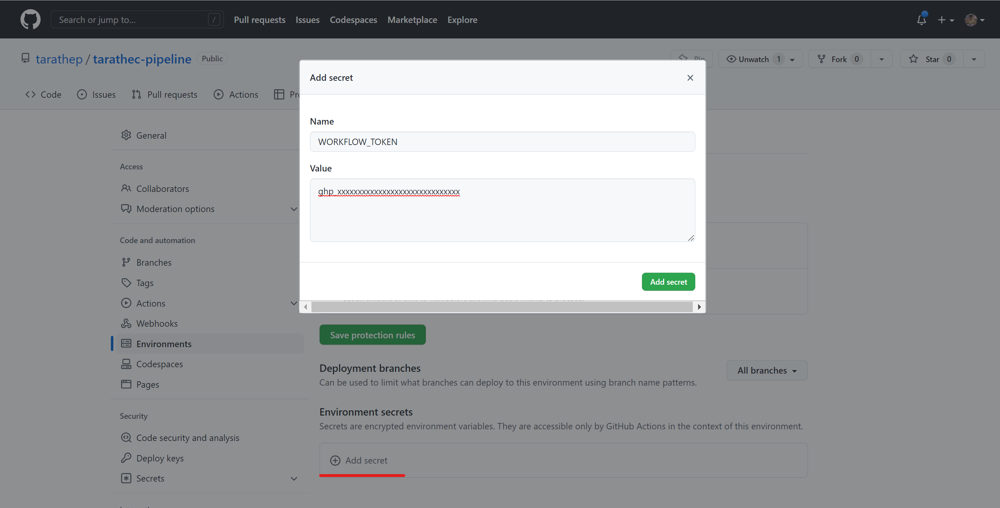

# Lab3: Implement workflows deploy to Appservice SIT Environment

Learn how continuous deployment or delivery application to Azure that working on GitHub Actions and implementation basic concepts.

After completing this lab, you'll be able to: 

- Explain and Implement CD workflows with GitHub Actions in fundamental.

- Explain Branching strategy working with each environment.

- Automation workflows and how to use Actions.

- Investigate and solvable working on pipeline.


## Prerequisites

- <b>Required lab Install GitHub Action Runner</b>
- <b>Required lab2 Implement workflows deploy to Appservice on DEV Environment</b>
- <b>Workspace that required Software and Tools</b>
    - Git and GitHub Account
    - Text Editor (Required <b>Visual Studio Code</b>, or Visual Studio) [Visual Studio Code - Code Editing. Redefined](https://code.visualstudio.com/)

- <b>Infrastructures or Resources on Azure (Depend on before lab)</b>
    - Virtual Machine (Self-hosted Ubuntu)
    - Azure App service (Webapp support deploy code and dotnet6)
    - Azure App service plan (Windows or Linux)
    - Azure Cosmos DB for MongoDB API ([Step for Initialize cosmos DB](./init-cosmos-db.md))
    - Azure Key Vault (if any)
    - Azure Application Insights (if any)

## Checking Resources Ready

On the Azure Spoke checking list belows
- `app-<username>-az-usw3-dev-001`
- `app-<username>-az-usw3-sit-001`
- `id-<username>SelfHost-az-usw3-sbx-001`
- `mongo-<username>-az-usw3-sbx-001`
- `vm-<username>SelfHost-az-usw3-sbx-001`


## Initialize GitHub workflow

Checkout the source code from GitHub ```github.com/<username>/<username>-pipeline```.

Open the terminal following command below

```bash
git clone https://github.com/<username>/<username>-pipeline.git
```

Open the project with text editor (Visual Studio Code) and create new folder named github/workflows in root directory of project (git).

```bash
mkdir .github/workflows
```


GitHub workflow is working on inside *.github/workflows* that contains GitHub workflows files that extension named .yaml

## Create SIT - Tutorial BE Deploy workflows

On Create SIT - Tutorial BE Deploy workflows is working when manunal workflows dispatch will automate deploy to Azure WebApp.


Create the new file named ```sit-tutorial-be-deploy.yml``` inside ```.github/workflows``` this on the Workflows SIT which contains 1 workflow DEV Deploy.


### Name

The first name starts with declare name of workflows

```yaml
name: SIT - Tutorial BE Deploy
```

### On (Events that trigger workflows)

Enter events when do you want to execute or trigger the workflows

you can see more of event type at [Events that trigger workflows - GitHub Docs](https://docs.github.com/en/actions/using-workflows/events-that-trigger-workflows)

```yaml
on:
  workflow_dispatch:
    inputs:
      ref:
        description: "Repository branch or tag"
        required: true
        default: "v1.0.0"
```

### Env

the environment global to declaration and variables

```yaml
env:
  REPOSITORY: "<username>/<username>-tutorial-backend"
  GITREF: ${{ github.event.inputs.ref }}
  ARTIFACT_NAME: "artifact-tutorial-backend"
  APP_RESOURCE_NAME: app-<username>-az-usw3-dev-001
```

### Jobs

Groups together all the jobs that run in the SIT - Tutorial BE Deploy workflow.

```yaml
jobs:
...
```

#### Deploy

The build artifact to contains in the job

```yaml
  deploy-app-service:
    name: Deploy
    runs-on: [ self-hosted, tara-sbx, vm-<username>SelfHost-az-usw3-sbx-001 ]
    environment:
      name: sit
      url: https://sit-<username>-web.azure101.ml/swagger/index.html

```

##### Steps

```yaml
    steps:
    - name: Download Artifact
      uses: robinraju/release-downloader@v1.3
      with:
        repository: ${{ env.REPOSITORY }}
        tag: ${{ env.GITREF }}
        fileName: ${{ env.ARTIFACT_NAME }}-${{ env.GITREF }}.tar.gz
        token: ${{ secrets.WORKFLOW_TOKEN }}

    - name: Extract Artifact
      run : |
        mkdir -p ${{ env.ARTIFACT_NAME }}-${{ env.GITREF }}
        tar -zxf ${{ github.workspace }}/${{ env.ARTIFACT_NAME }}-${{ env.GITREF }}.tar.gz -C ${{ github.workspace }}/${{ env.ARTIFACT_NAME }}-${{ env.GITREF }}
        rm ${{ github.workspace }}/${{ env.ARTIFACT_NAME }}-${{ env.GITREF }}.tar.gz
    - name: Login via Azure CLI
      run: |
        az login --identity --username ${{ secrets.AZURE_SELFHOST_USER_MANAGE_IDENTITY_CLIENT_ID }}
        az account set --subscription ${{ secrets.AZURE_SUBSCRIPTION_ID }}
    - name: Deploy to Azure WebApp
      uses: azure/webapps-deploy@v2
      with:
        app-name: ${{ env.APP_RESOURCE_NAME }}
        package: ${{ github.workspace }}/${{ env.ARTIFACT_NAME }}-${{ env.GITREF }}

    - name: Clear Cache
      run: |
        rm -rf ${{ github.workspace }}/${{ env.ARTIFACT_NAME }}-${{ env.GITREF }}

    - name: DAST (OWASP ZAP) Dispatch
      uses: peter-evans/repository-dispatch@v1
      with:
        token: ${{ secrets.WORKFLOW_TOKEN }}
        repository: ${{ env.REPOSITORY }}
        event-type: <username>-tutorial-be-dast-sit
        client-payload: '{"ref": "${{ github.ref }}", "sha": "${{ github.sha }}"}'
```


Commit and push code to GitHub repository on main branch.

Go back to repository `<username>-pipeline` on tab Actions you can see workflow named ```SIT - Tutorial BE Deploy``` visible


before run this workflow you must config variable secrets at Settings > Environments > sit

if you don't found environment named ```sit``` you can click create New environment button and enter ```sit```


click on envionment ```sit``` name to set Environment secrets

Enter 

- Name : ```WORKFLOW_TOKEN```
    -  Value : ```ghp_xxxxxxxxxxxxxxxxx```
- Name : ```AZURE_SELFHOST_USER_MANAGE_IDENTITY_CLIENT_ID```
    - Value : ```xxxxxxxx-xxxx-xxxx-xxxx-xxxxxxxxxxxx```
- Name: ```AZURE_SUBSCRIPTION_ID```
    - Value : ```xxxxxxxx-xxxx-xxxx-xxxx-xxxxxxxxxxxx```




Go back to Acitons tab and run workflows ```SIT - Tutorial BE Deploy```.


**Summany Code**

```yaml
name: SIT - Tutorial BE Deploy

on:
  workflow_dispatch:
    inputs:
      ref:
        description: "Repository branch or tag"
        required: true
        default: "v1.0.0"

env:
  REPOSITORY: "<username>/<username>-tutorial-backend"
  GITREF: ${{ github.event.inputs.ref }}
  ARTIFACT_NAME: "artifact-tutorial-backend"
  APP_RESOURCE_NAME: app-<username>-az-usw3-dev-001

jobs:
  deploy-app-service:
    name: Deploy
    runs-on: [ self-hosted, tara-sbx, vm-<username>SelfHost-az-usw3-sbx-001 ]
    environment:
      name: sit
      url: https://sit-<username>-web.azure101.ml/swagger/index.html
    
    steps:
    - name: Download Artifact
      uses: robinraju/release-downloader@v1.3
      with:
        repository: ${{ env.REPOSITORY }}
        tag: ${{ env.GITREF }}
        fileName: ${{ env.ARTIFACT_NAME }}-${{ env.GITREF }}.tar.gz
        token: ${{ secrets.WORKFLOW_TOKEN }}

    - name: Extract Artifact
      run : |
        mkdir -p ${{ env.ARTIFACT_NAME }}-${{ env.GITREF }}
        tar -zxf ${{ github.workspace }}/${{ env.ARTIFACT_NAME }}-${{ env.GITREF }}.tar.gz -C ${{ github.workspace }}/${{ env.ARTIFACT_NAME }}-${{ env.GITREF }}
        rm ${{ github.workspace }}/${{ env.ARTIFACT_NAME }}-${{ env.GITREF }}.tar.gz
    - name: Login via Azure CLI
      run: |
        az login --identity --username ${{ secrets.AZURE_SELFHOST_USER_MANAGE_IDENTITY_CLIENT_ID }}
        az account set --subscription ${{ secrets.AZURE_SUBSCRIPTION_ID }}
    - name: Deploy to Azure WebApp
      uses: azure/webapps-deploy@v2
      with:
        app-name: ${{ env.APP_RESOURCE_NAME }}
        package: ${{ github.workspace }}/${{ env.ARTIFACT_NAME }}-${{ env.GITREF }}

    - name: Clear Cache
      run: |
        rm -rf ${{ github.workspace }}/${{ env.ARTIFACT_NAME }}-${{ env.GITREF }}

    - name: DAST (OWASP ZAP) Dispatch
      uses: peter-evans/repository-dispatch@v1
      with:
        token: ${{ secrets.WORKFLOW_TOKEN }}
        repository: ${{ env.REPOSITORY }}
        event-type: <username>-tutorial-be-dast-sit
        client-payload: '{"ref": "${{ github.ref }}", "sha": "${{ github.sha }}"}'
```

**Logging**

