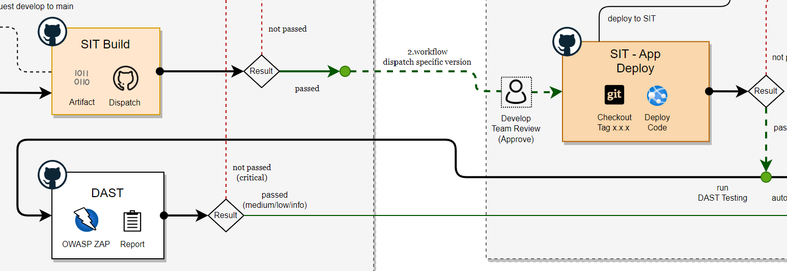
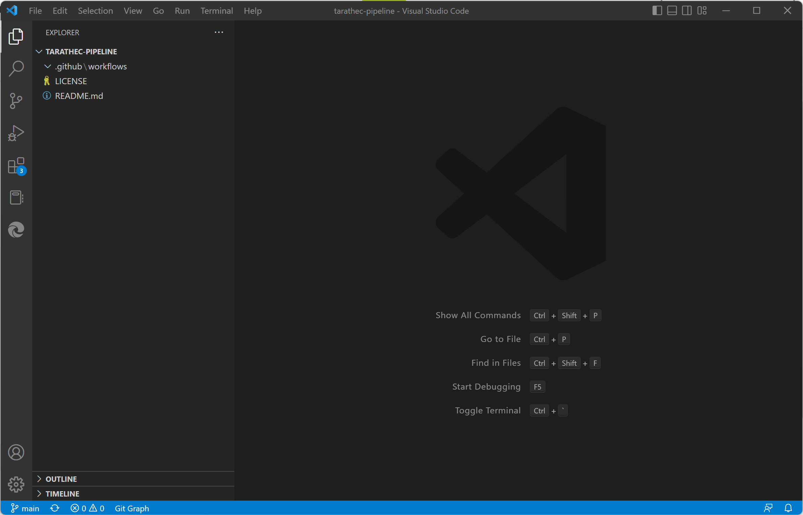
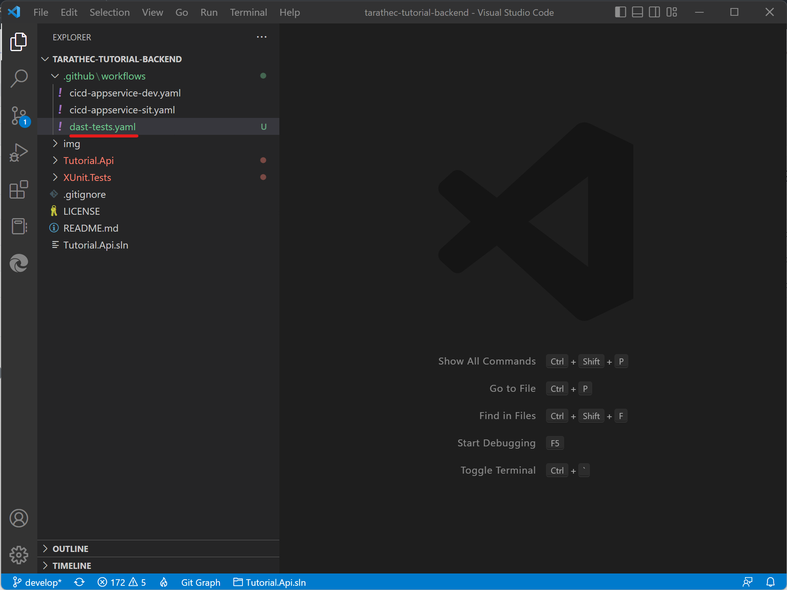

# Lab3: Implement workflows deploy to Appservice SIT Environment



Learn how continuous deployment or delivery application to Azure that working on GitHub Actions and implementation basic concepts.

After completing this lab, you'll be able to: 

- Explain and Implement CD workflows with GitHub Actions in fundamental.

- Explain Branching strategy working with each environment.

- Automation workflows and how to use Actions.

- Investigate and solvable working on pipeline.


## Prerequisites

- <b>Required lab Install GitHub Action Runner</b>
- <b>Required lab2 Implement workflows deploy to App service on DEV Environment</b>
- <b>Workspace that required Software and Tools</b>
    - Git and GitHub Account
    - Text Editor (Required <b>Visual Studio Code</b>, or Visual Studio) [Visual Studio Code - Code Editing. Redefined](https://code.visualstudio.com/)

- <b>Infrastructures or Resources on Azure (Depend on before lab)</b>
    - Virtual Machine (Self-hosted Ubuntu)
    - Azure App service (Webapp support deploy code and dotnet6)
    - Azure App service plan (Windows or Linux)
    - Azure Cosmos DB for MongoDB API ([Step for Initialize cosmos DB](./init-cosmos-db.md))
    - Azure Key Vault (if any)
    - Azure Application Insights (if any)

## Checking Resources Ready

On the Azure Spoke checking list belows
- `app-<username>-az-usw3-dev-001`
- `app-<username>-az-usw3-sit-001`
- `id-<username>SelfHost-az-usw3-sbx-001`
- `mongo-<username>-az-usw3-sbx-001`
- `vm-<username>SelfHost-az-usw3-sbx-001`


## Initialize GitHub workflow

Checkout the source code from GitHub ```github.com/<username>/<username>-pipeline```.

Open the terminal following command below

```bash
git clone https://github.com/<username>/<username>-pipeline.git
```

Open the project with text editor (Visual Studio Code) and create new folder named ```.github/workflows``` in root directory of project (git).

```bash
mkdir .github/workflows
```



GitHub workflow is working on inside ```.github/workflows``` that contains GitHub workflows files that extension named ```.yaml```

## Create SIT - Tutorial BE Deploy workflows

On Create SIT - Tutorial BE Deploy workflows is working when manual workflows dispatch will automate deploy to Azure WebApp.


Create the new file named ```sit-tutorial-be-deploy.yml``` inside ```.github/workflows``` this on the Workflows SIT which contains 1 workflow SIT Deploy.


### Name

The first name starts with declare name of workflows

```yaml
name: SIT - Tutorial BE Deploy
```

### On (Events that trigger workflows)

Enter events when do you want to execute or trigger the workflows

you can see more of event type at [Events that trigger workflows - GitHub Docs](https://docs.github.com/en/actions/using-workflows/events-that-trigger-workflows)

```yaml
on:
  workflow_dispatch:
    inputs:
      ref:
        description: "Repository branch or tag"
        required: true
        default: "v1.0.0"
```

### Env

the environment global to declaration and variables

```yaml
env:
  REPOSITORY: "<username>/<username>-tutorial-backend"
  GITREF: ${{ github.event.inputs.ref }}
  ARTIFACT_NAME: "artifact-tutorial-backend"
  APP_RESOURCE_NAME: app-<username>-az-usw3-sit-001
```

### Jobs

Groups together all the jobs that run in the SIT - Tutorial BE Deploy workflow.

```yaml
jobs:
...
```

#### Deploy

The deploy artifact to contains in the job

```yaml
  deploy-app-service:
    name: Deploy
    runs-on: [ self-hosted, tara-sbx, vm-<username>SelfHost-az-usw3-sbx-001 ]
    environment:
      name: sit
      url: https://sit-<username>-web.azure101.ml/swagger/index.html

```

##### Steps

```yaml
    steps:
    - name: Download Artifact
      uses: robinraju/release-downloader@v1.3
      with:
        repository: ${{ env.REPOSITORY }}
        tag: ${{ env.GITREF }}
        fileName: ${{ env.ARTIFACT_NAME }}-${{ env.GITREF }}.tar.gz
        token: ${{ secrets.WORKFLOW_TOKEN }}

    - name: Extract Artifact
      run : |
        mkdir -p ${{ env.ARTIFACT_NAME }}-${{ env.GITREF }}
        tar -zxf ${{ github.workspace }}/${{ env.ARTIFACT_NAME }}-${{ env.GITREF }}.tar.gz -C ${{ github.workspace }}/${{ env.ARTIFACT_NAME }}-${{ env.GITREF }}
        rm ${{ github.workspace }}/${{ env.ARTIFACT_NAME }}-${{ env.GITREF }}.tar.gz
    - name: Login via Azure CLI
      run: |
        az login --identity --username ${{ secrets.AZURE_SELFHOST_USER_MANAGE_IDENTITY_CLIENT_ID }}
        az account set --subscription ${{ secrets.AZURE_SUBSCRIPTION_ID }}
    - name: Deploy to Azure WebApp
      uses: azure/webapps-deploy@v2
      with:
        app-name: ${{ env.APP_RESOURCE_NAME }}
        package: ${{ github.workspace }}/${{ env.ARTIFACT_NAME }}-${{ env.GITREF }}

    - name: Clear Cache
      run: |
        rm -rf ${{ github.workspace }}/${{ env.ARTIFACT_NAME }}-${{ env.GITREF }}

    - name: DAST (OWASP ZAP) Dispatch
      uses: peter-evans/repository-dispatch@v1
      with:
        token: ${{ secrets.WORKFLOW_TOKEN }}
        repository: ${{ env.REPOSITORY }}
        event-type: <username>-tutorial-be-dast-sit
        client-payload: '{"ref": "${{ github.ref }}", "sha": "${{ github.sha }}"}'
```


Commit and push code to GitHub repository on main branch.

Go back to repository `<username>-pipeline` on tab Actions you can see workflow named ```SIT - Tutorial BE Deploy``` visible


before running this workflow, you must config variable secrets at *Settings > Environments > sit*

if you don't found environment named ```sit``` you can click create `New environment` button and enter ```sit```


click on environment ```sit``` name to set Environment secrets

Enter 

- Name : ```WORKFLOW_TOKEN```
    -  Value : ```ghp_xxxxxxxxxxxxxxxxx```
- Name : ```AZURE_SELFHOST_USER_MANAGE_IDENTITY_CLIENT_ID```
    - Value : ```xxxxxxxx-xxxx-xxxx-xxxx-xxxxxxxxxxxx```
- Name: ```AZURE_SUBSCRIPTION_ID```
    - Value : ```xxxxxxxx-xxxx-xxxx-xxxx-xxxxxxxxxxxx```


Go back to Actions tab and run workflows ```SIT - Tutorial BE Deploy```.


**Summary Code**

```yaml
name: SIT - Tutorial BE Deploy

on:
  workflow_dispatch:
    inputs:
      ref:
        description: "Repository branch or tag"
        required: true
        default: "v1.0.0"

env:
  REPOSITORY: "<username>/<username>-tutorial-backend"
  GITREF: ${{ github.event.inputs.ref }}
  ARTIFACT_NAME: "artifact-tutorial-backend"
  APP_RESOURCE_NAME: app-<username>-az-usw3-sit-001

jobs:
  deploy-app-service:
    name: Deploy
    runs-on: [ self-hosted, tara-sbx, vm-<username>SelfHost-az-usw3-sbx-001 ]
    environment:
      name: sit
      url: https://sit-<username>-web.azure101.ml/swagger/index.html
    
    steps:
    - name: Download Artifact
      uses: robinraju/release-downloader@v1.3
      with:
        repository: ${{ env.REPOSITORY }}
        tag: ${{ env.GITREF }}
        fileName: ${{ env.ARTIFACT_NAME }}-${{ env.GITREF }}.tar.gz
        token: ${{ secrets.WORKFLOW_TOKEN }}

    - name: Extract Artifact
      run : |
        mkdir -p ${{ env.ARTIFACT_NAME }}-${{ env.GITREF }}
        tar -zxf ${{ github.workspace }}/${{ env.ARTIFACT_NAME }}-${{ env.GITREF }}.tar.gz -C ${{ github.workspace }}/${{ env.ARTIFACT_NAME }}-${{ env.GITREF }}
        rm ${{ github.workspace }}/${{ env.ARTIFACT_NAME }}-${{ env.GITREF }}.tar.gz
    - name: Login via Azure CLI
      run: |
        az login --identity --username ${{ secrets.AZURE_SELFHOST_USER_MANAGE_IDENTITY_CLIENT_ID }}
        az account set --subscription ${{ secrets.AZURE_SUBSCRIPTION_ID }}
    - name: Deploy to Azure WebApp
      uses: azure/webapps-deploy@v2
      with:
        app-name: ${{ env.APP_RESOURCE_NAME }}
        package: ${{ github.workspace }}/${{ env.ARTIFACT_NAME }}-${{ env.GITREF }}

    - name: Clear Cache
      run: |
        rm -rf ${{ github.workspace }}/${{ env.ARTIFACT_NAME }}-${{ env.GITREF }}

    - name: DAST (OWASP ZAP) Dispatch
      uses: peter-evans/repository-dispatch@v1
      with:
        token: ${{ secrets.WORKFLOW_TOKEN }}
        repository: ${{ env.REPOSITORY }}
        event-type: <username>-tutorial-be-dast-sit
        client-payload: '{"ref": "${{ github.ref }}", "sha": "${{ github.sha }}"}'
```

**Logging**


---
## Create SIT - Configuration Set workflows

Configuration to deploy to Azure WebApp.

<div align=center></div>

Create the new file named ```sit-tutorial-be-configuration-set.yml``` inside ```.github/workflows``` this on the Workflows which contains configure to App service (Webapp)


### Name

The first name starts with declare name of workflows

```yaml
name: SIT - Tutorial BE Configuration
```

### On (Events that trigger workflows)

Enter events when do you want to execute or trigger the workflows

you can see more of event type at [Events that trigger workflows - GitHub Docs](https://docs.github.com/en/actions/using-workflows/events-that-trigger-workflows)

```yaml
on:
  workflow_dispatch:
```

### Jobs

Groups together all the jobs that run in the DEV - Tutorial BE Deploy workflow.

```yaml
jobs:
...
```

#### Set Configuration

The build artifact to contains in the job

```yaml
  set-configuration:
    name: set appservice configuration
    runs-on: [ self-hosted, <username>-sbx, vm-<username>SelfHost-az-usw3-sbx-001 ]
    environment: sit
```

##### Steps

```yaml
    steps:
    - name: Login via Azure CLI
      run: |
        az login --identity --username ${{ secrets.AZURE_SELFHOST_USER_MANAGE_IDENTITY_CLIENT_ID }}
        az account set --subscription ${{ secrets.AZURE_SUBSCRIPTION_ID }}

    - name: Set Web App Settings
      uses: Azure/appservice-settings@v1
      with:
        app-name: app-<username>-az-usw3-sit-001
        app-settings-json: |
          [
            {
              "name": "TutorialDatabase__ConnectionString",
              "value": "${{ secrets.TUTORIAL_DB_CONNECTION_STRING }}",
              "slotSetting": false
            },
            {
              "name": "TutorialDatabase__DatabaseName",
              "value": "sit-tutorial",
              "slotSetting": false
            },
            {
              "name": "TutorialDatabase__TutorialCollectionName",
              "value": "tutorials",
              "slotSetting": false
            }
          ]
```


Commit and push code to GitHub repository on main branch.

Go back to repository `<username>-pipeline` on tab Actions you can see workflow named ```SIT - Tutorial BE Configuration``` visible


before running this workflow, you must config variable secret at *Settings > Environments > sit*

Enter 

- Name : ```TUTORIAL_DB_CONNECTION_STRING```
- Value : ```mongodb://...```


and go back to Actions tab and run workflows ```SIT - Tutorial BE Configuration```.


Result of output to set on Configuration Webapp.


Try to access via URL `https://sit-<username>-web.azure101.ml/swagger/index.html`


**Summany Code**

```yaml
name: SIT - Tutorial BE Configuration

on:
  workflow_dispatch:

jobs:
  set-configuration:
    name: set appservice configuration
    runs-on: [ self-hosted, <username>-sbx, vm-<username>SelfHost-az-usw3-sbx-001 ]
    environment: sit
    steps:
    - name: Login via Azure CLI
      run: |
        az login --identity --username ${{ secrets.AZURE_SELFHOST_USER_MANAGE_IDENTITY_CLIENT_ID }}
        az account set --subscription ${{ secrets.AZURE_SUBSCRIPTION_ID }}

    - name: Set Web App Settings
      uses: Azure/appservice-settings@v1
      with:
        app-name: app-<username>-az-usw3-sit-001
        app-settings-json: |
          [
            {
              "name": "TutorialDatabase__ConnectionString",
              "value": "${{ secrets.TUTORIAL_DB_CONNECTION_STRING }}",
              "slotSetting": false
            },
            {
              "name": "TutorialDatabase__DatabaseName",
              "value": "sit-tutorial",
              "slotSetting": false
            },
            {
              "name": "TutorialDatabase__TutorialCollectionName",
              "value": "tutorials",
              "slotSetting": false
            }
          ]
          
```

**Logging**


---

## DAST workflows (Dynamic Application Security Testing)

On DAST workflows is working after SIT deploy succeeded that based on [OWASP ZAP](https://www.zaproxy.org/) tool

<div align=center></div>

this workflow locates on CI repository you will add workflow at `https://github.com/<username>/<username>/tutorial-backend`

Download and Open tutorial-backend project with Visual Studio Code

```bash
git clone https://github.com/<username>/<username>/tutorial-backend

cd <username>/tutorial-backend

code .
```

Inside `.github/workflows` directory.

create the new file named ```dast-tests.yaml``` inside ```.github/workflows```



### Name

The first name starts with declare name of workflows

```yaml
name: DAST OWSAP ZAP (No auth)
```

### On (Events that trigger workflows)

Enter events when do you want to execute or trigger the workflows

you can see more of event type at [Events that trigger workflows - GitHub Docs](https://docs.github.com/en/actions/using-workflows/events-that-trigger-workflows)

```yaml
on:
  repository_dispatch:
    types: [<username>-tutorial-be-dast-sit]
  workflow_dispatch:
    inputs:
      env:
        description: Environment
        required: true
        default: 'sit'
```

### Jobs

Groups together all the jobs that run in the SIT - Tutorial BE Deploy workflow.

```yaml
jobs:
...
```

#### DAST Scan

The DAST SCAN to contain in jobs

```yaml
  dast_zap_scan:
    name: DAST (OWASP ZAP)
    runs-on: ubuntu-latest
    environment: ${{ github.event_name == 'repository_dispatch' && 'sit' || github.event.inputs.env }}
```

##### Steps

```yaml
    steps:
    - name: ZAP Scan
      uses: zaproxy/action-full-scan@v0.4.0
      with:
        token: ${{ secrets.GITHUB_TOKEN }}
        target: "https://${{ github.event_name == 'repository_dispatch' && 'sit' || github.event.inputs.env }}-<username>-web.azure101.ml/api/tutorials"
            
    - name: Create sarif file from zaproxy results
      uses: SvanBoxel/zaproxy-to-ghas@main
    
    - name: Upload SARIF file
      uses: github/codeql-action/upload-sarif@v2
      with:
          sarif_file: results.sarif
```


Commit and push code to GitHub repository on main branch.

Go back to repository `<username>/<username>-tutorial-backend` on tab Actions you can see workflow named ```DAST OWASP ZAP (No auth)``` visible

Run workflow enter environment to scanning


Report OWASP ZAP


**Summary Code**

```yaml
name: "DAST OWSAP ZAP (No auth)"

on:
  repository_dispatch:
    types: [<username>-tutorial-be-dast-sit]
  workflow_dispatch:
    inputs:
      env:
        description: Environment
        required: true
        default: 'sit'

jobs:
  dast_zap_scan:
    name: DAST (OWASP ZAP)
    runs-on: ubuntu-latest
    environment: ${{ github.event_name == 'repository_dispatch' && 'sit' || github.event.inputs.env }}
    
    steps:
    - name: ZAP Scan
      uses: zaproxy/action-full-scan@v0.4.0
      with:
        token: ${{ secrets.GITHUB_TOKEN }}
        target: "https://${{ github.event_name == 'repository_dispatch' && 'sit' || github.event.inputs.env }}-<username>-web.azure101.ml/api/tutorials"
            
    - name: Create sarif file from zaproxy results
      uses: SvanBoxel/zaproxy-to-ghas@main
    
    - name: Upload SARIF file
      uses: github/codeql-action/upload-sarif@v2
      with:
          sarif_file: results.sarif
```

**Logging**

