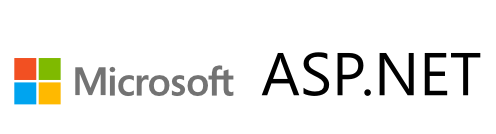
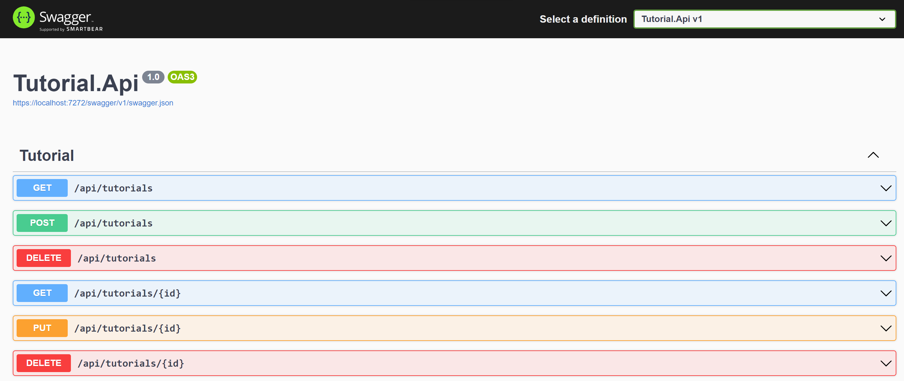
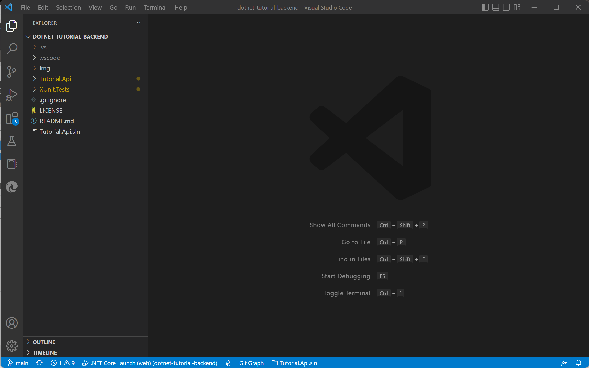
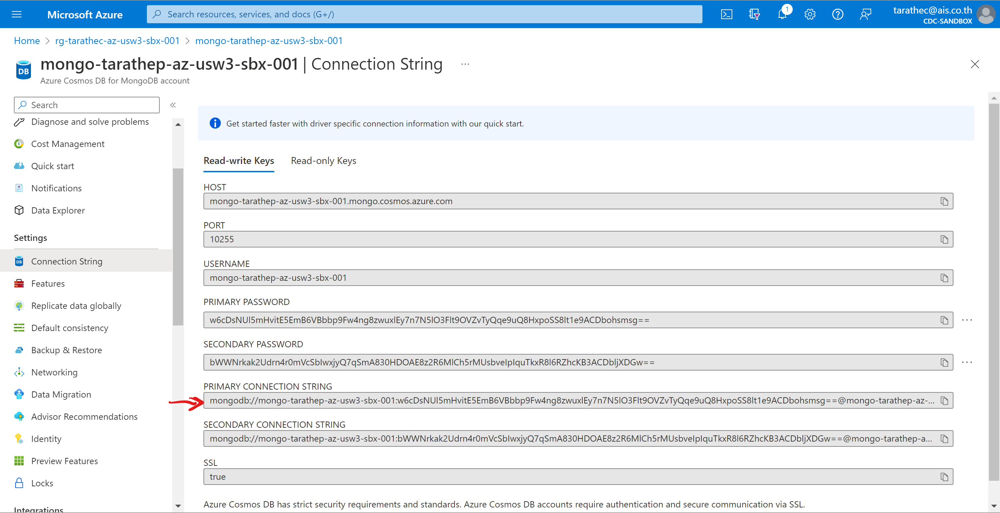

# Lab 1: Initialization Application



Learn how application working and implementation concepts.

After completing this lab, you'll be able to:

- Describe or explain how to design and implement application. 
- Explain debug and run project that implement with Dotnet 6 and C# (ASP.NET Web application).
- Describe or explain how to use API (Application Programming Interface) via Restful API protocol HTTP by Command CRUD (Create, Read, Update and Delete).
- Describe or explain how to implementation of Unit Test and Mock Test to test business services and APIs.

In this lab we use sample application that is named Tutorial API Backend and Tutorial Frontend we focus on Backend application.



## Prerequisites

- <b>Workspace that required Software and Tools</b>
    - Dotnet 6 you can download at official site: [Download .NET 6.0 (Linux, macOS, and Windows) (microsoft.com)](https://dotnet.microsoft.com/en-us/download/dotnet/6.0) focus on SDK
    - Git and GitHub Account
    - Text Editor (Required <b>Visual Studio Code</b>, or Visual Studio) [Visual Studio Code - Code Editing. Redefined](https://code.visualstudio.com/)
    - AZ CLI ([How to install the Azure CLI | Microsoft Learn](https://learn.microsoft.com/en-us/cli/azure/install-azure-cli))

- <b>Infrastructures or Resources on Azure (Depend on before lab)</b>
    - Azure App service (Webapp support deploy code and dotnet6) 
    - Azure App service plan (Windows or Linux)
    - Azure Cosmos DB for MongoDB API ([Step for Initialize cosmos DB](./init-cosmos-db.md))
    - Azure Key Vault (if any)
    - Azure Application Insights (if any)

## 1. Reviewing source code and Inspect
download source code program from GitHub with git command: 

```ps
git clone https://github.com/tarathep/dotnet-tutorial-backend.git
```
when downloaded success open this project with text editor (Visual Studio Code)

Walkthrough and describe project on Structure project inside directory (dotnet-tutorial-backend)

you can open with command to open with Visual Studio Code by following command below

```ps
cd dotnet-tutorial-backend
code .
```



or you can alternative solution to open.

you can see this inside we are focusing 2 projects

- <b>Tutorial.Api.sln</b> is control solution file that contain 2 projects and specific to support Dotnet project in dotnet SDK on Visual Studio and Visual Studio Code.
- <b>Tutorial.Api</b> is APIs application for runtime and business.
- <b>XUnit.Tests</b> is Unit Tests by test Tutorial.Api focus on Business logics inside service and controller.

## 2. Prepare to configuration application

In Application Tutorial.Api  you can see file app.settings.json

before try to run you must set values in bellows

- TutorialDatabase
    - ConnetionString : <i>“enter the value by copy connection from azure portal“ </i>
    - DatabaseName : <i>”enter the value named <b>dev-tutorial</b>”</i>



- ApplicationInsights (Optional)
    - ConnectionString : <i>“copy connection string from“</i>

```json
{
  "TutorialDatabase": {
    "ConnectionString": "",
    "DatabaseName": "",
    "TutorialCollectionName": "tutorials"
  },
  "Logging": {
    "ApplicationInsights": {
      "LogLevel":{
        "Default": "Debug",
        "Microsoft": "Error"
      }
    },
    "LogLevel": {
      "Default": "Trace",
      "Microsoft.AspNetCore": "Warning"
    }
  },
  "AllowedHosts": "*",
  "ApplicationInsights": {
    "ConnectionString": ""
  }
}
```

## 3. First to use and running Application on Local
please checking system you’re ready.

Check dotnet SDK 6 on your workspace


dotnet --version
Restore dependencies and projects


dotnet clean
dotnet restore
And then try to run on localhost


cd Tutorial.Api
dotnet run
PS. please check database CosmosDB that named mongo-{name}-az-usw3-sbx-001 to allow access public internet. (Specific IP address)
