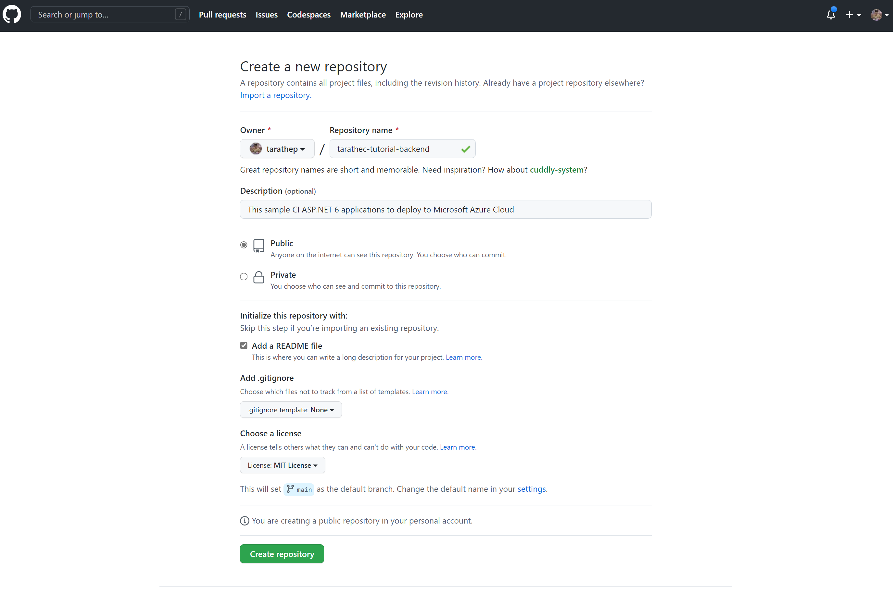
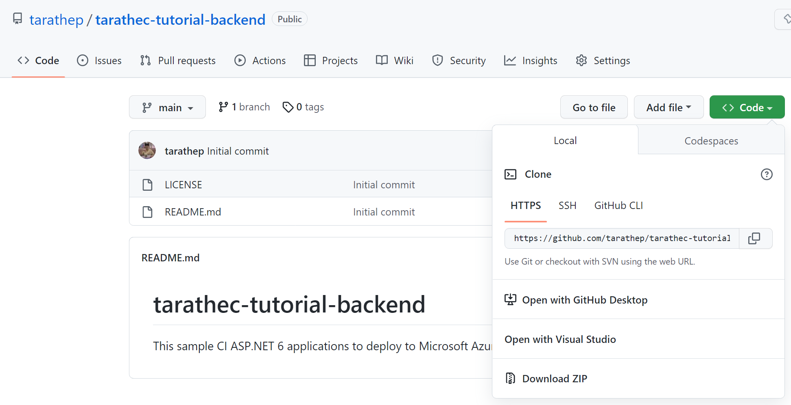
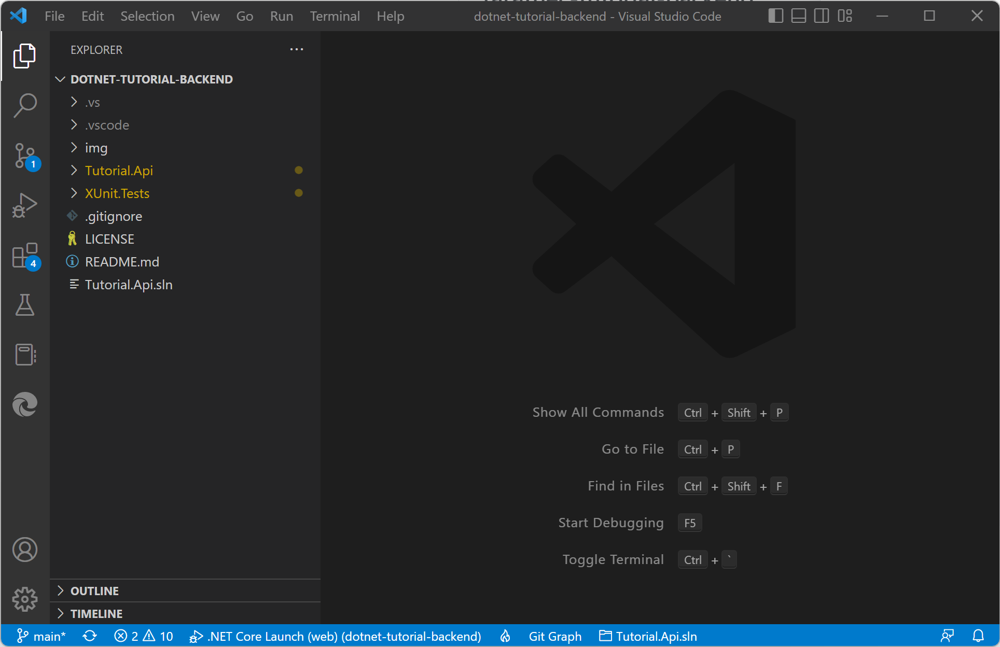
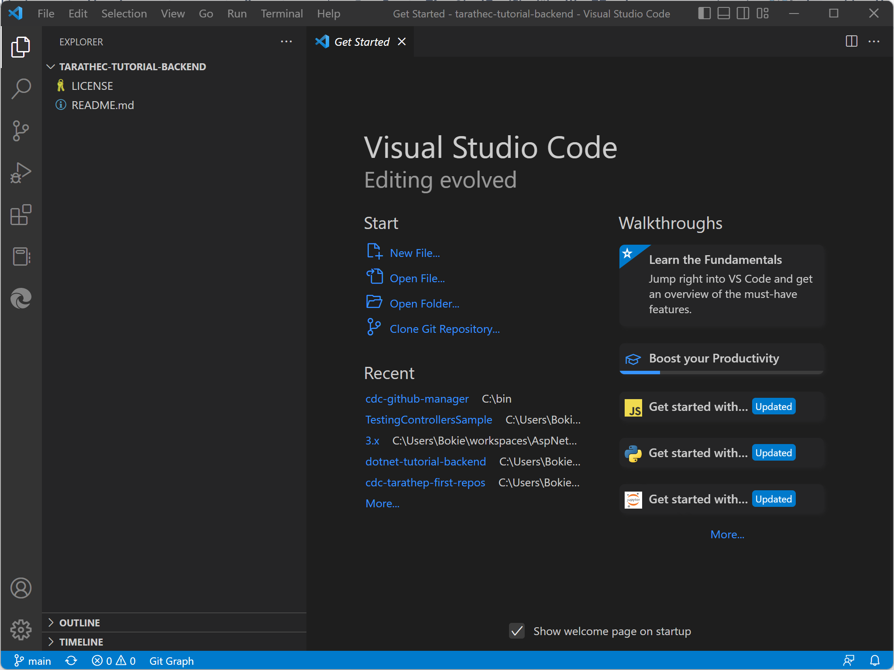
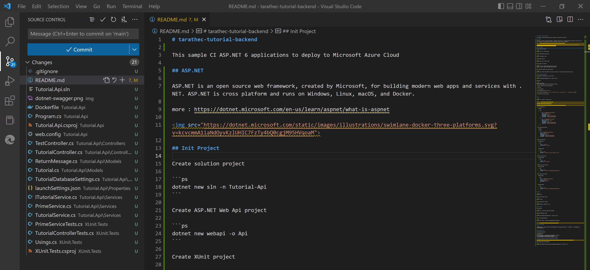
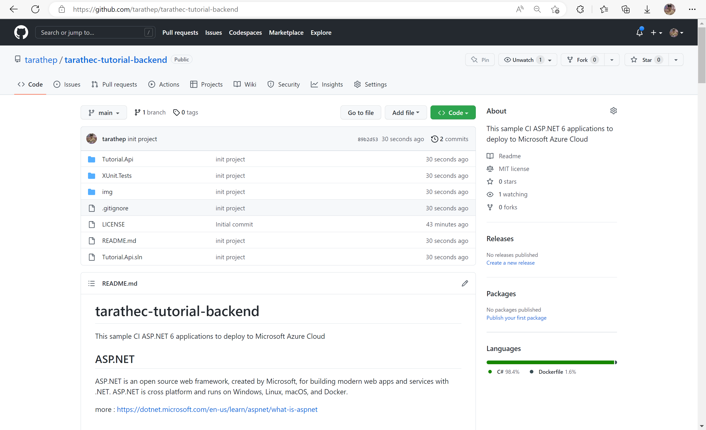

## Lab 2: Migrate Application to your Git repository

Learn how to migrate application to your git repository

After completing this lab, you'll be able to:
- Have an application on your GitHub repository.
- Create Continuous Integration repository.
- Copy application from another repository to target repository 

## Prerequisites

Workspace that required Software and Tools

- **Git and GitHub Account**
- **Text Editor** (Required Visual Studio Code, or Visual Studio) Visual Studio Code - Code Editing. Redefined

## Create repository on GitHub

go to the github.com/{username}

select new repository on the top right-hand side.

- Owner: {username}
- Repository name: {username or name}-tutorial-backend
- Description: Optional
- Public
- Initialize this repository with
    - Add a README file
    - Choose a license: MIT License

use on branch main to default branch




## Working repository on local

In this repository page you can see *<>Code* button, copy the URL to checkout



Open the Terminal to use this command to clone source repository from  github.com/tarathep/dotnet-tutorial-backend into your local workspace.

```cmd
git clone https://github.com/tarathep/dotnet-tutorial-backend.git
cd dotnet-tutorial-backend
code .
```

And open this project with Visual Studio Code



And open another window Terminal and use this command to clone empty your repository.

```cmd
git clone https://github.com/{username}/{username}-tutorial-backend.git
cd {username}-tutorial-backend.git
```

And open this project with Visual Studio Code



Copy all source codes and files from *dotnet-tutorial-backend* to *{username}-tutorial-backend* (Overwrite)

and push to your GitHub repository.

```cmd
git add .
git commit -m "init project"
git push
```

alternative you can use Visual Studio Code Git



when finished you will see this.

