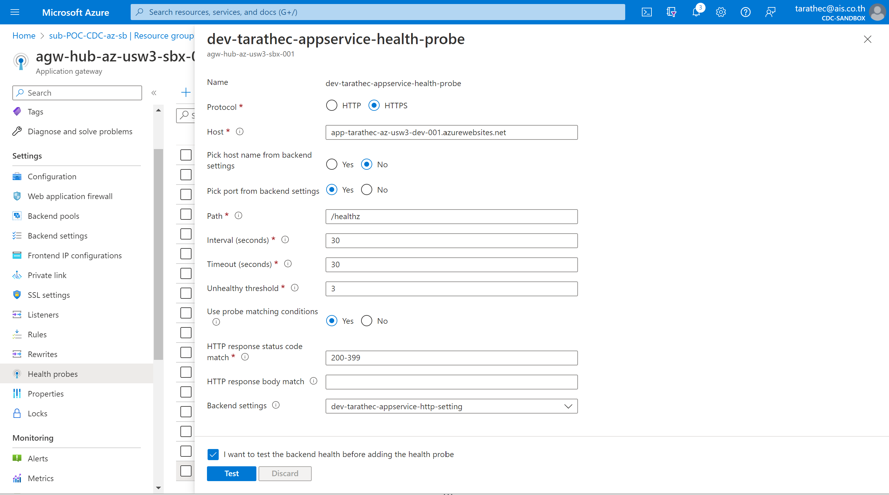

# Lab 3: Build Artifact and Deploy to Azure App Service (Web App)

<div align=center></div>

Learn how build dotnet application output to artifact and deploy to Azure App service (Webapp)

After completing this lab, you'll be able to:
- Explain how to build Dotnet project application.
- Explain how to deploy application to Azure with CLI (AZ Command).

## Prerequisites

- **Workspace that required Software and Tools**
    - Dotnet 6 you can download at official site: Download .NET 6.0 (Linux, macOS, and Windows) (microsoft.com) focus on SDK
    - Git and GitHub Account
    - Text Editor (Required Visual Studio Code, or Visual Studio) Visual Studio Code - Code Editing. Redefined
    - AZ CLI (How to install the Azure CLI | Microsoft Learn)
- **Infrastructures or Resources on Azure** (Depend on before lab)
    - Azure App service (Webapp support deploy code and dotnet6)
    - Azure App service plan (Windows or Linux)
    - Azure Cosmos DB for MongoDB API (Step for Initialize cosmos DB)
    - Azure Key Vault (if any)
    - Azure Application Insights (if any)
- **Required Lab 2**

## Build Artifact

On the lab2 you have already to source code project on workspaces or you can checkout from your GitHub repository

git clone https://github.com/tarathep/tarathec-tutorial-backend.git
 
Open this project with Visual Studio Code


Open the Terminal to build project with dotnet command

Check dotnet SDK version

```cmd
dotnet --version
```

Focusing on project Tutorial.Api by make sure currently directory and run following command 

Clean package and cached

```cmd
dotnet clean
```

Restore dependencies into project

```cmd
dotnet restore
```

Build artifact that output to bin directory (binary file)

```cmd
dotnet build
```


Build and publish a release to output

```cmd
dotnet publish -c Release -o out
```


you can see in this project files, the output artifact into ```bin\Release\net6.0\Tutorial.Api.dll``` and output to deploy out to ```out```


Endpoint to execute or run at ```Tutorial.Api.dll``` or ```Tutorial.Api.exe``` and Configurations in ```web.config``` and ```appsettings.json```

Run Application with Artifact with this command

```cmd
dotnet ./Tutorial.Api.dll
```

<i><p style="color:red">P.S. before running please check appsettings.json to configuration when you try to call APIs may be found error in this console.</p></i>


## Deploy with Az command to App service (Webapp)
 
On Azure portal [Microsoft Azure](http://portal.azure.com/)  check resource to deploy to ```app-<username>-az-usw3-dev-001``` at subscription named ```sub-POC-CDC-az-sb``` in resource group named ```rg-<username>-az-usw3-sbx-001```.


Click on ```app-<username>-az-usw3-dev-001``` and try to access via public internet with URL *https://app-\<username>-az-usw3-dev-001.azurewebsites.net*


you will see this Error 403 - Forbidden that is right, so you must allow access to deploy outside in spoke (interim for this lab).


if you access with this domain *https://dev-\<username>-web.azure101.ml/*


you can access it, so allow access via internet by go to the left conner blade click on *Networking* menu, on the *Inbound Traffic* in features you can see *Access restriction*.


Access restriction page, Checked ```Allow public access``` and then save.


Test accessing on public internet with domain *app-\<username>-az-usw3-dev-001.azurewebsites.net* 

from 403 Forbidden to 200 successes.


Go back to portal and open the ```Cloud Shell``` to deploy application by click logo *cloud shell* on the top right-hand side.


Open Cloud Shell in bash mode


use AZ Command to login

```cmd
az login --tenant xxxxxx-xxxx-xxxx-xxxx-xxxxxxxxxxxx
```
Set subscription

```cmd
az account set --subscription sub-POC-CDC-az-sb
```
Check access resource

```cmd
az resource list --name 'app-<username>-az-usw3-dev-001'
```


Checkout code from GitHub to Cloud Shell

```cmd
git clone https://github.com/username/username-tutorial-backend.git
cd username-tutorial-backend/Tutorial.Api
```


Build release artifact with command

```cmd
dotnet restore
dotnet publish -c Release -o out
cd out
```


you can see in files out directory and use command to zip all files

```cmd
zip -r release.zip .
```

in this directory will find ```release.zip``` to deploy


deploy to Azure webapp with command

This command is in preview and under development. Reference and support levels: [Reference types, status and support levels – Azure CLI](https://aka.ms/CLI_refstatus)

```cmd
az webapp deploy --resource-group rg-<username>-az-usw3-sbx-001 --name app-<username>-az-usw3-dev-001 --type zip --src-path release.zip
```


For configuration app via command

**Environment variables**


|Env Name| Value|
|---|---|
TutorialDatabase__ConnectionString|mongodb://xxxxxxxx|
|TutorialDatabase__DatabaseName|tutorialdb|
|TutorialDatabase__TutorialCollectionName|tutorials|

```cmd 
az webapp config appsettings set --resource-group rg-<username>-az-usw3-sbx-001 --name app-<username>-az-usw3-dev-001 --settings TutorialDatabase__ConnectionString=''

az webapp config appsettings set --resource-group rg-<username>-az-usw3-sbx-001 --name app-<username>-az-usw3-dev-001 --settings TutorialDatabase__DatabaseName='dev-tutorial'

az webapp config appsettings set --resource-group rg-<username>-az-usw3-sbx-001 --name app-<username>-az-usw3-dev-001 --settings TutorialDatabase__TutorialCollectionName='tutorials'
```

more: [Deploy files to App Service - Azure App Service | Microsoft Learn](https://learn.microsoft.com/en-us/azure/app-service/deploy-zip?tabs=cli#deploy-a-zip-package)


## Test applications

Access via public internet with domain https://app-username-az-usw3-dev-001.azurewebsites.net/swagger


on the POST : ```/api/tutorials```

try to add value

```json
{
  "title": "asp.net",
  "description": "azure101"
}
```


and get to value

on the GET : ```/api/tutorials```


when application test was done, go to the **Access restrictions** page, **Unchecked** ```Allow public access``` and then save.


and access to Domain 

from https://app-username-az-usw3-dev-001.azurewebsites.net/swagger/ to https://dev-username-web.azure101.ml/swagger

you will see this Error page 502 Bad Gateway


go to app gateway to change **health probe** and try again. or On ```agw-hub-az-usw3-sbx-001``` the left conner below you can see ```Health probes``` and find your health probes named ```dev-<username>-appservice-health-probe```


change health check path from ```/``` to ```/healthz``` and Backend settings select your backend setting that named ```dev-<username>-appservice-http-setting```



and then Test and Save

try again to access via public internet with domain *https://dev\<username>-web.azure101.ml/swagger*


and test GET to query data with URL *https://dev-\<username>-web.azure101.ml/api/tutorials*


