# Lab 4: Containerization with Docker

<div align=center></div>

Learn how application working and implementation concepts.

After completing this lab, you'll be able to:
- Explain containers app and image with docker concept.
- Explain how to use Dockerfile with application and reflector code to support container type.
- Can use basic command with docker to build, debug and publish to container registry.

In this lab we use sample application that is named Tutorial API Backend and Tutorial Frontend we focus on Backend application


## Prerequisites

- **Workspace that required Software and Tools**
- **Git and GitHub Account**
- **Text Editor** (Required Visual Studio Code, or Visual Studio) Visual Studio Code - Code Editing. Redefined
- **Docker CE (community Edition)** Docker Desktop - Docker
- **AZ CLI** (How to install the Azure CLI | Microsoft Learn)
- **required Lab2**

## First Docker Command

On Windows OS start Docker Desktop

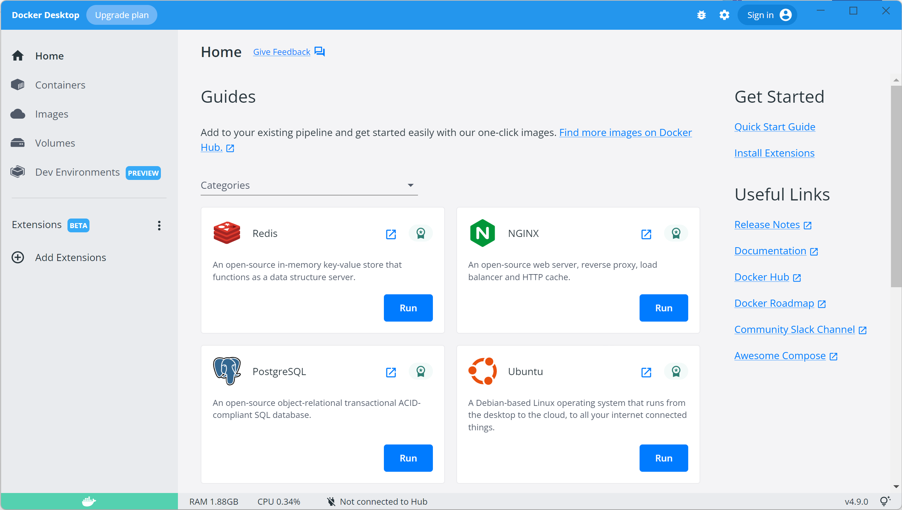

Open the Terminal to use docker command and run command in below

to check version

```cmd
docker version
```
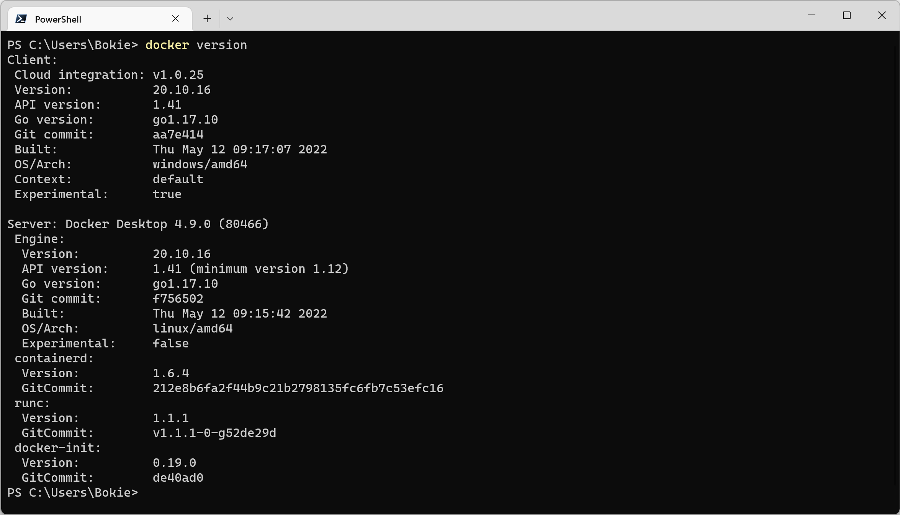

**Assignment**

Pull image from nignx and run by expose on port 80 and access to localhost

[docker cheat sheet](https://www.docker.com/wp-content/uploads/2022/03/docker-cheat-sheet.pdf)

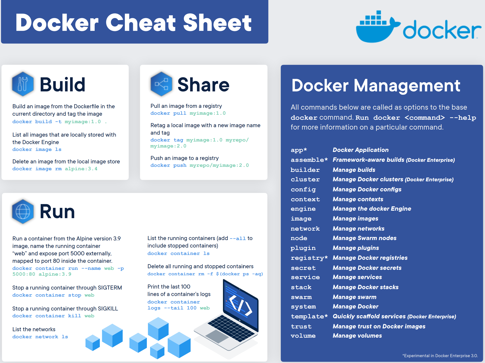

## Working with Dockerfile

On the project Tutorial API Backend, you can download with your GitHub with command 

```cmd
git clone https://github.com/<username>/<username>-tutorial-backend.git

cd <username>-tutorial-backend
```

Open Visual Studio Code

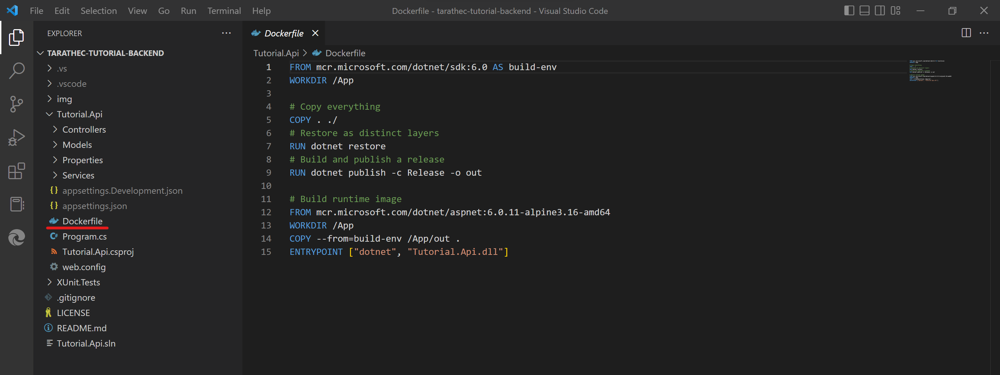

You can see have Dockerfile into project

 
**Review Dockerfile**

```dockerfile
FROM mcr.microsoft.com/dotnet/sdk:6.0 AS build-env
WORKDIR /App

# Copy everything
COPY . ./
# Restore as distinct layers
RUN dotnet restore
# Build and publish a release
RUN dotnet publish -c Release -o out

# Build runtime image
FROM mcr.microsoft.com/dotnet/aspnet:6.0.11-alpine3.16-amd64
WORKDIR /App
COPY --from=build-env /App/out .
ENTRYPOINT ["dotnet", "Tutorial.Api.dll"]
```

Open Terminal and use command to 

```cmd
cd Tutorial.Api
ls
```

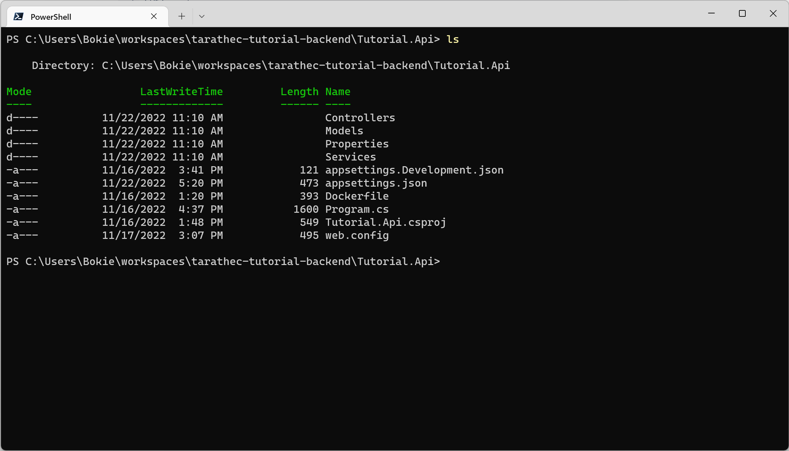

Build image

```cmd
docker build -t tutorial-be:0.0.1 .
```

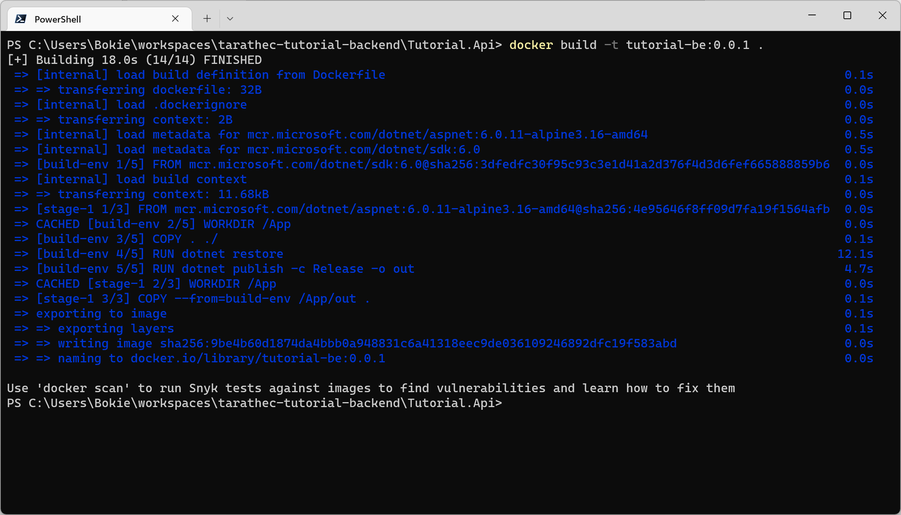

Check Image to build

```cmd
docker image ls
```

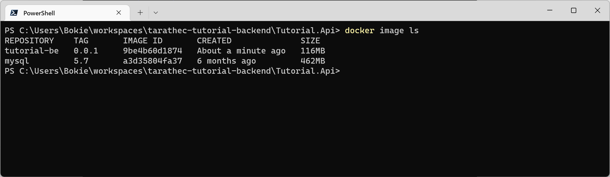

Run image to container

```cmd
docker run -it --rm --name tutorial-be -p 80:80 tutorial-be:0.0.1
```

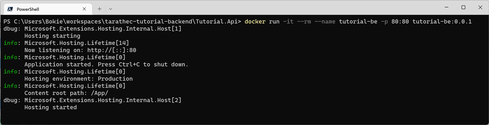

Access to http://localhost/swagger

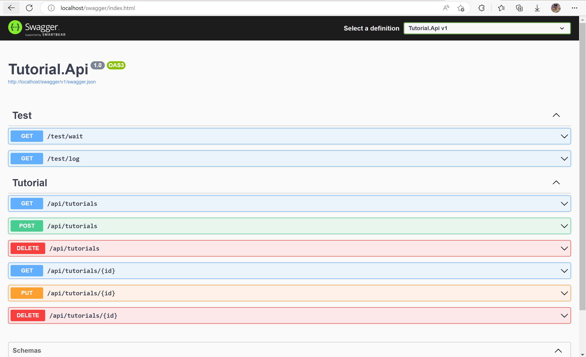

If you want to try APIs, you must set configuration via Environment Variables

**Environment variables**


|Env Name|Value|
|---|---|
|TutorialDatabase__ConnectionString|mongodb://xxxxxxxx|
|TutorialDatabase__DatabaseName|tutorial|
|TutorialDatabase__TutorialCollectionName|tutorials|
|ApplicationInsights__ConnectionString|…|

Option -e

example 

```cmd
docker run -it --rm --name tutorial-be -p 80:80 -e TutorialDatabase__ConnectionString='mongodb://xxxxxxxx' -e TutorialDatabase__DatabaseName='dev-tutorial' tutorial-be:0.0.1
```

## Working on Container Registry

focusing on GitHub Container Registry

On GitHub you can see on Packages to store artifact package included to docker image.

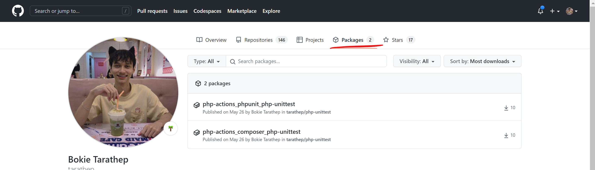

this is private container registry that when you use must login

we want to push image to private registry ```ghcr.io```

Login docker

```cmd
docker login ghcr.io -u <username> --password ghp_xxxxxxxxxxxx
```

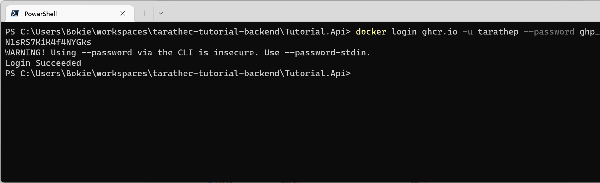

for the generate github personal token credential to auth

go to the GitHub page and top right conner click on image profile and select 

*Settings > Developer settings >*

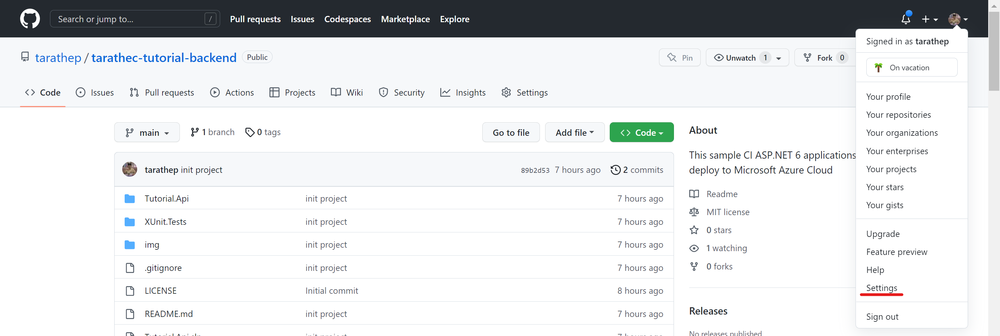

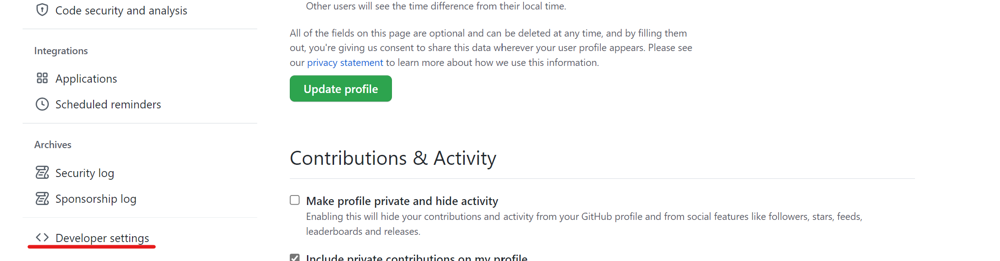

Select Generate new token (classic)

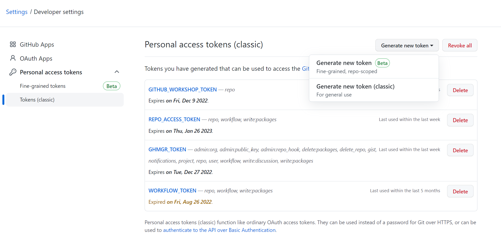

Enter on Note: Azure101

and Select scopes
- repo
- workflow
- write: package
- delete: package

and then click Generate Token Button

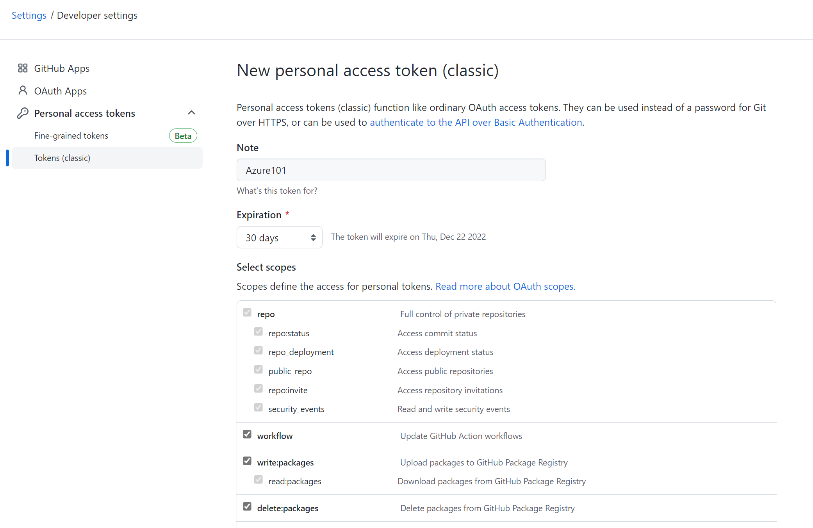

Before push image to ghcr.io you must change the image name with docker tag

```cmd
docker tag tutorial-be:0.0.1 ghcr.io/<username>/tutorial-be:0.0.1
```

Push image to ```ghcr.io```

```cmd
docker push ghcr.io/<username>/tutorial-be:0.0.1
```

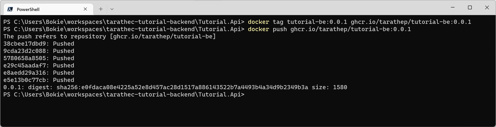

Checking on your GitHub package on GitHub Page you can see ```tutorial-be``` image.

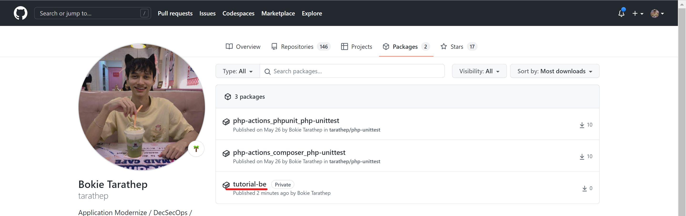

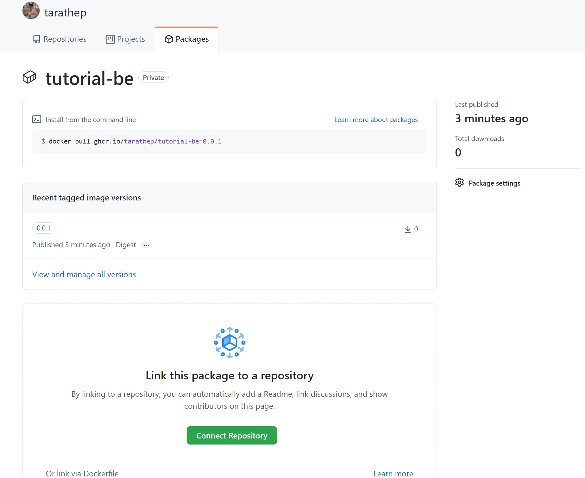


