# Lab 5: Continuous Integration with GitHub Actions

Learn how continuous integrate application working on GitHub Actions and implementation basic concepts.

After completing this lab, you'll be able to: 

- Explain and Implement CI workflows with GitHub Actions in fundamental.
- Explain Branching strategy working with each environment.
- Automation workflows and how to use Actions.
- Investigate and solvable working on pipeline.


## Prerequisites

- **Workspace that required Software and Tools**
    - Git and GitHub Account
    - Text Editor (Required Visual Studio Code, or Visual Studio) [Visual Studio Code - Code Editing. Redefined](https://code.visualstudio.com/)
- depending on lab 4

## Workflows Diagram

<div align=center>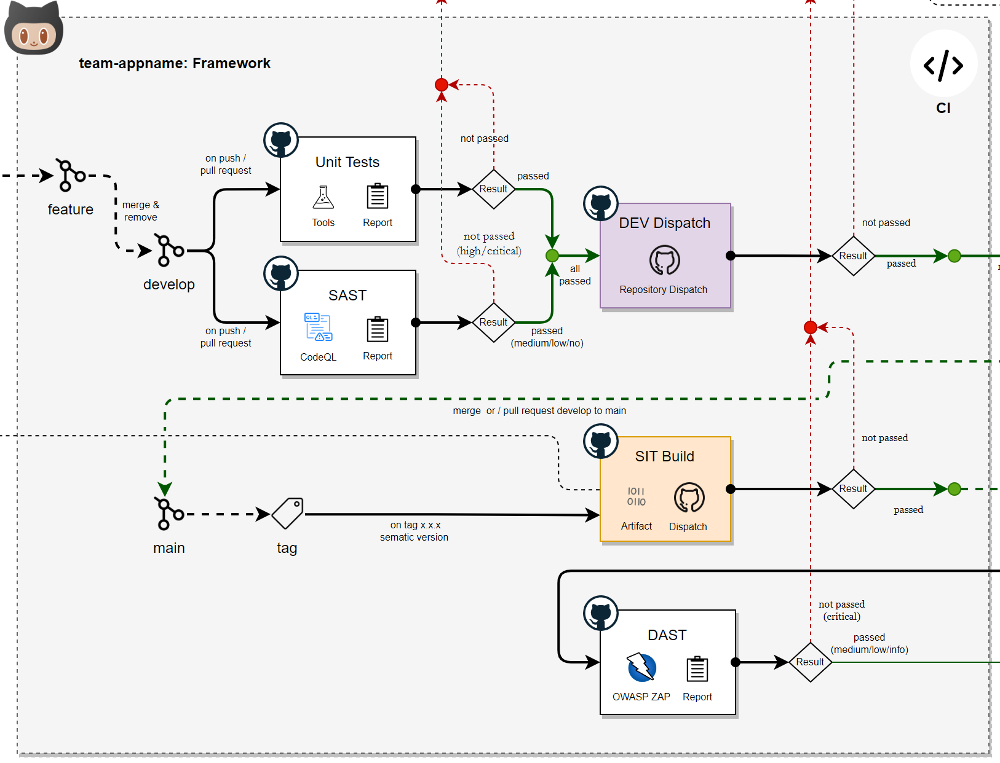</div>

## Initialize GitHub workflow

Checkout the source code from GitHub *github.com/<username>/<username>-tutorial-backend*.

Open the terminal following command below

```cmd
git clone https://github.com/<username>/<username>-tutorial-backend.git
```

Open the project with text editor (Visual Studio Code) and create new folder named *github/workflows* in root directory of project (git).

```cmd
mkdir .github/workflows
```


GitHub workflow is working on inside ```.github/workflows``` that contains GitHub workflows files that extension named ```.yaml```

## Create Develop workflows

On develop workflows branch is working on branch develop and automate by developer when push code to GitHub repository on branch develop.

<div align=center>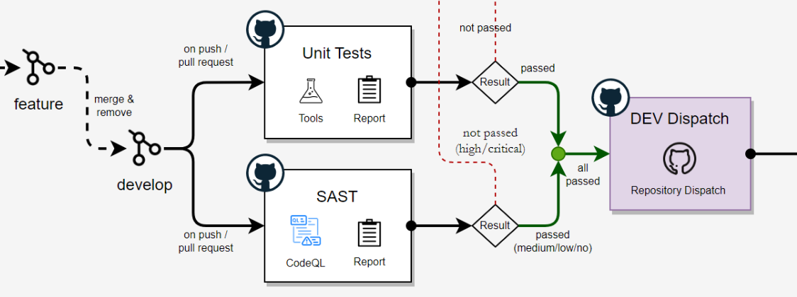</div>

Create the new file named ```cicd-appservice-dev.yaml``` inside ```.github/workflows``` this on the Workflows Dev which contains 3 workflows: *Unit Tests*, *SAST* and *DEV Dispatch*.

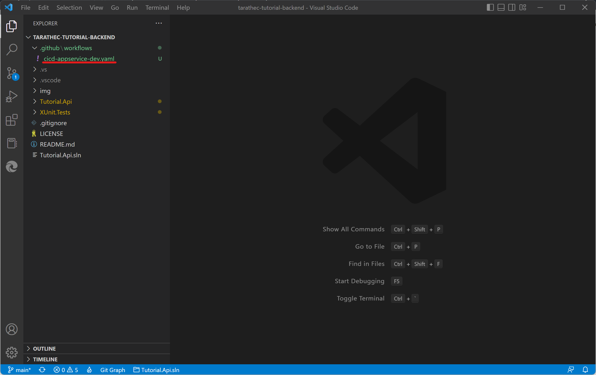

### Name

The first name starts with declare name of workflows

```yaml
name: DEV - Dispatch
```

### On (Events that trigger workflows)

Enter events when do you want to execute or trigger the workflows

you can see more of event type at [Events that trigger workflows - GitHub Docs](https://docs.github.com/en/actions/using-workflows/events-that-trigger-workflows) 

```yaml
on: 
  push:
    branches:    
      - develop
  workflow_dispatch:
```

### Jobs

Groups together all the jobs that run in the DEV - Dispatch workflow.

```yaml
jobs:
...
```

---

#### Unit Tests

The unit tests contain in the job

```yaml
  unitest:
    name: UnitTest (XUnit)
    runs-on: ubuntu-latest
    environment:
      name: dev
```

**Steps**

```yaml
    steps:
    - name: Checkout code
      uses: actions/checkout@v2

    - name: Setup .NET Core SDK
      uses: actions/setup-dotnet@v2.1.0
      with:
        dotnet-version: '6.0.x'

    - name: Install dependencies
      run: dotnet restore

    - name: Unit Test (XUnit)
      run: |
        dotnet test --collect:"XPlat Code Coverage"
        dotnet tool install -g dotnet-reportgenerator-globaltool
        reportgenerator -reports:"./XUnit.Tests/TestResults/*/coverage.cobertura.xml" -targetdir:"./coveragereport" -reporttypes:Html
    
    - name: Upload Reports
      uses: actions/upload-artifact@v2
      with:
        name: Unit Test Results
        path: '${{ github.workspace }}/coveragereport/*'
```

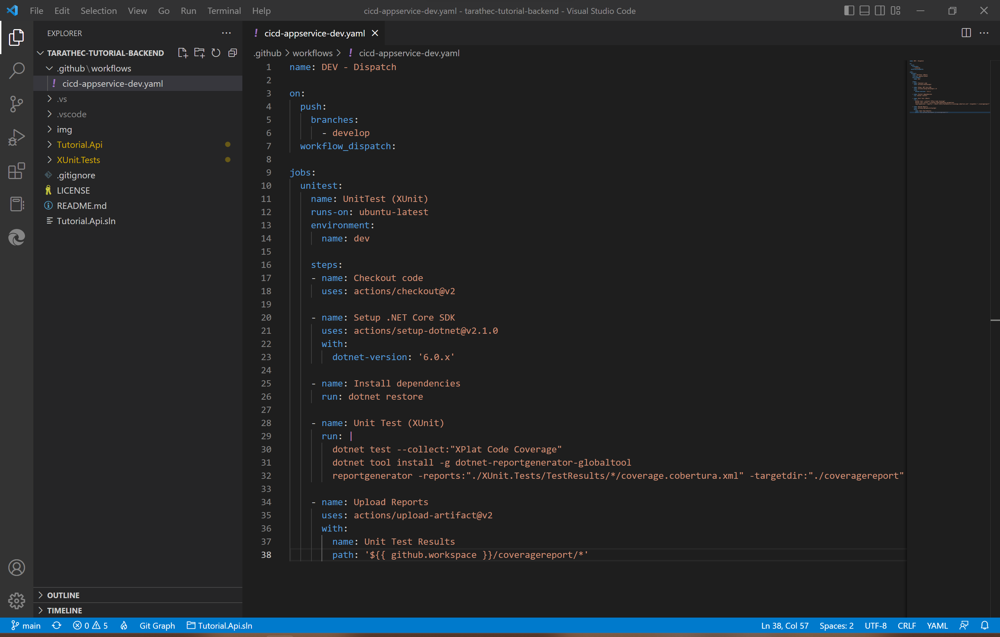

Commit and push code to GitHub repository on main branch.

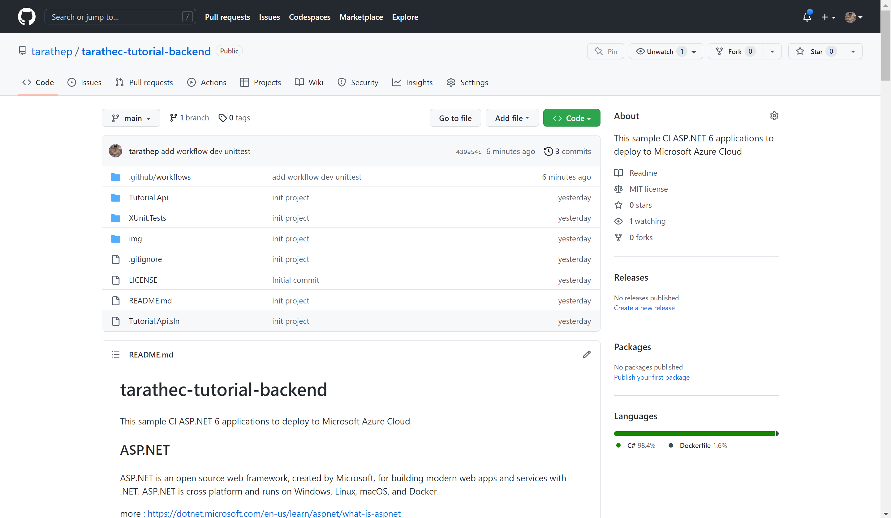

and then go to the Actions tab in the actions page you can see ```DEV - Dispatch``` workflow

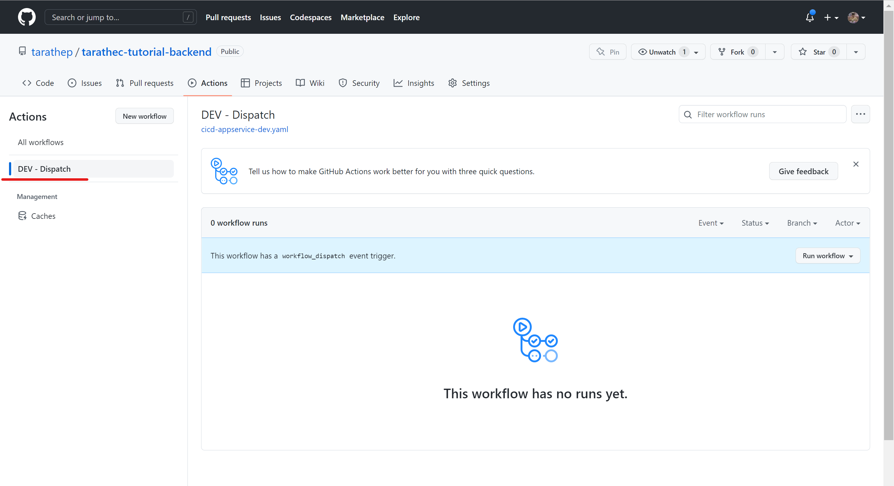

you can test this workflow to create new branch named ```develop``` from ```main``` branch.

on the local workspace create new branch with command

```cmd
git branch develop
git checkout develop
```

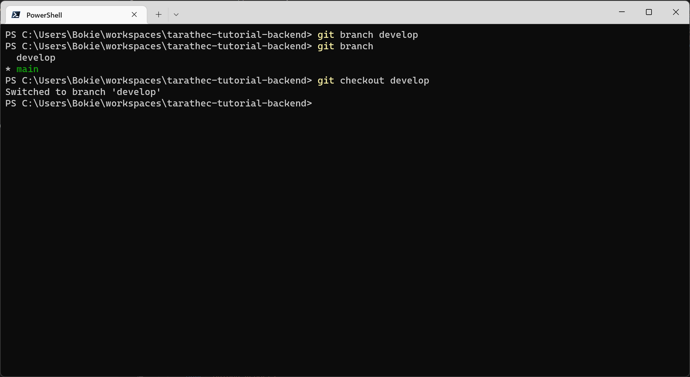

and push this new branch named ```develop``` to GitHub repository, for the first new branch use this command in below.

```cmd
git push --set-upstream origin develop
```

go back to repository on GitHub page, you can see the new branch named ```develop``` .

go to the **settings** repository to set **default branch** to ```develop``` branch

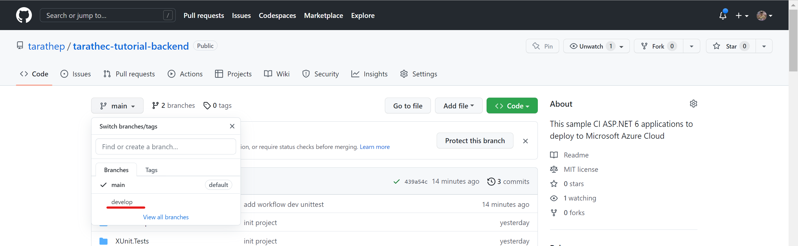

in panel Code and automation > select **Branches** > Click on icon arrow right left button.

popup dialog show and then change from **main** to **develop** at dropdown list button and update it.

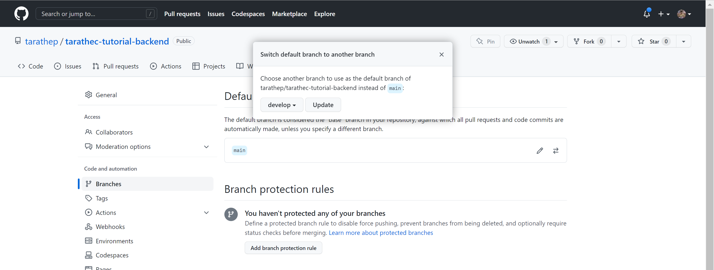

go back to Actions tab you can see the pipeline is running.

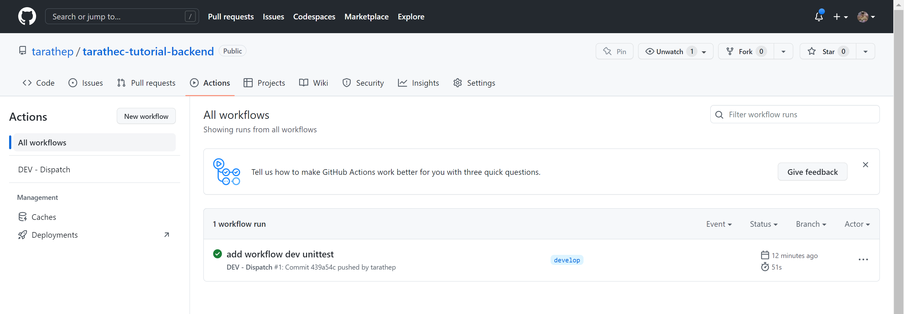

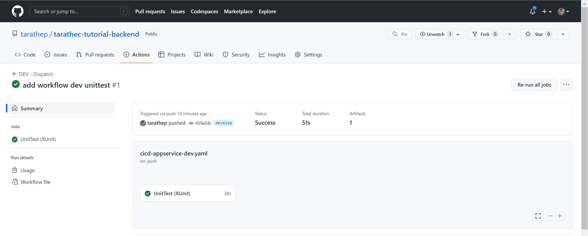


On Artifacts you can download Unit Test Results file to review reports of application

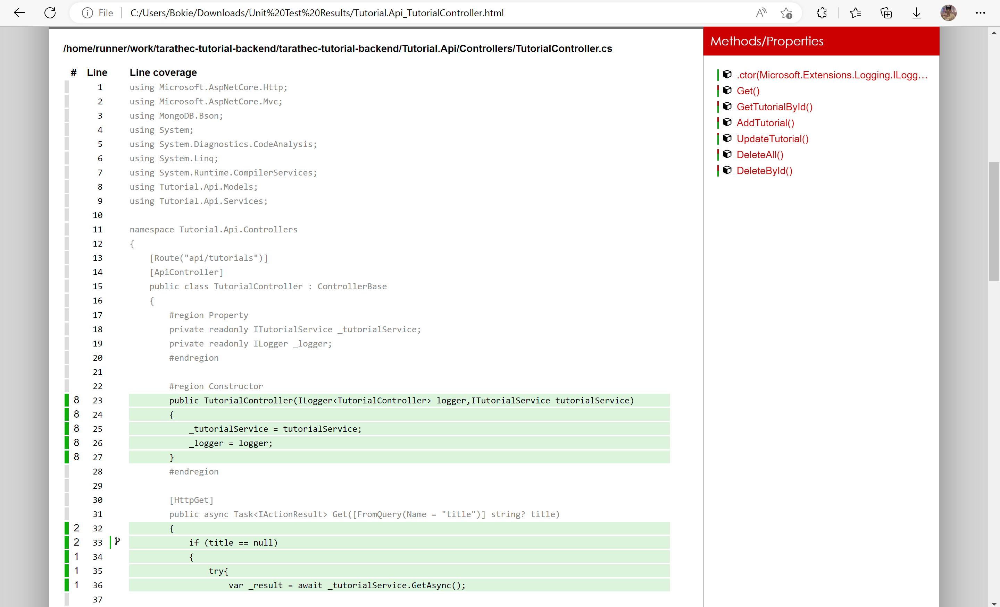

we are working on branch develop.

**Summary Code**

```yaml
name: DEV - Dispatch

on: 
  push:
    branches:    
      - develop
  workflow_dispatch:

jobs:
  unitest:
    name: UnitTest (XUnit)
    runs-on: ubuntu-latest
    environment:
      name: dev
    
    steps:
    - name: Checkout code
      uses: actions/checkout@v2

    - name: Setup .NET Core SDK
      uses: actions/setup-dotnet@v2.1.0
      with:
        dotnet-version: '6.0.x'

    - name: Install dependencies
      run: dotnet restore

    - name: Unit Test (XUnit)
      run: |
        dotnet test --collect:"XPlat Code Coverage"
        dotnet tool install -g dotnet-reportgenerator-globaltool
        reportgenerator -reports:"./XUnit.Tests/TestResults/*/coverage.cobertura.xml" -targetdir:"./coveragereport" -reporttypes:Html
    
    - name: Upload Reports
      uses: actions/upload-artifact@v2
      with:
        name: Unit Test Results
        path: '${{ github.workspace }}/coveragereport/*'
```

**logging**

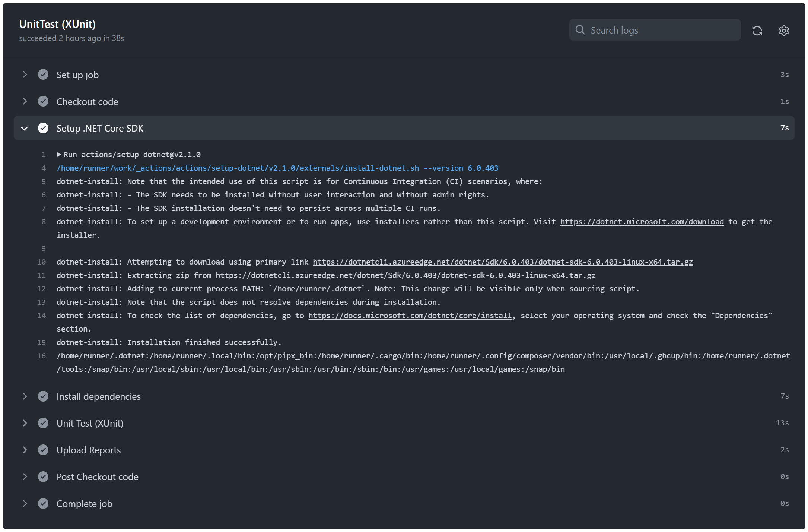

---

#### SAST (Static Application Security Testing)

Go back to workspace on local and add new job

```yaml
  analyze:
    name: SAST CodeQL
    runs-on: ubuntu-latest
    environment:
      name: dev
      url: https://github.com/corp-ais/<username>-tutorial-backend/security/code-scanning
    permissions:
      actions: read
      contents: read
      security-events: write

    strategy:
      fail-fast: false
      matrix:
        language: [ 'csharp' ]
```

**Steps**

```yaml
    steps:
    - name: Checkout repository
      uses: actions/checkout@v2

    - name: Initialize CodeQL
      uses: github/codeql-action/init@v2
      with:
        languages: ${{ matrix.language }}
       
    - name: Autobuild
      uses: github/codeql-action/autobuild@v2

    - name: Perform CodeQL Analysis
      uses: github/codeql-action/analyze@v2

    # THIS IS INTERNAL ACITON ACCESS ONLY INTERNAL OGANIZAITON
    # - name: Quality Gate Check
    #   uses: corp-ais/quality-gate-action@main
    #   with:
    #     repository: corp-ais/cdc-imgstorapi
    #     severity: high
    #   env:
    #     GITHUB_TOKEN: ${{ secrets.WORKFLOW_TOKEN }}
```

Commit and push code to GitHub repository on develop branch.

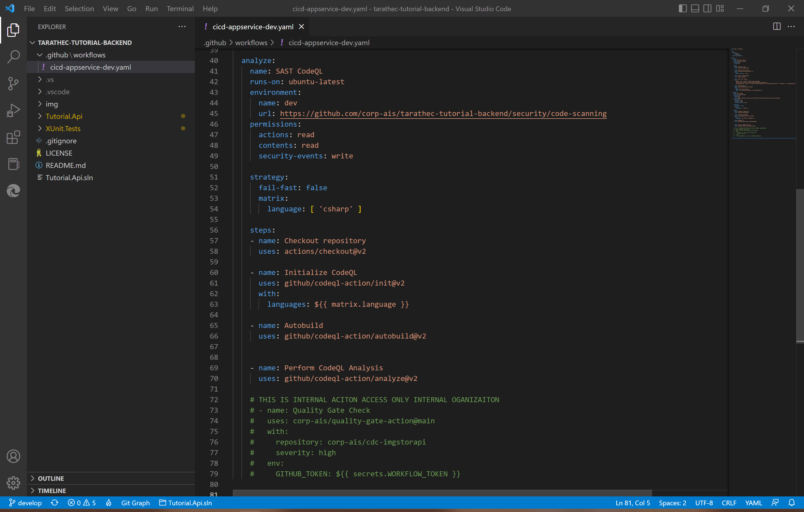

go back to Actions tab you can see the pipeline is running.

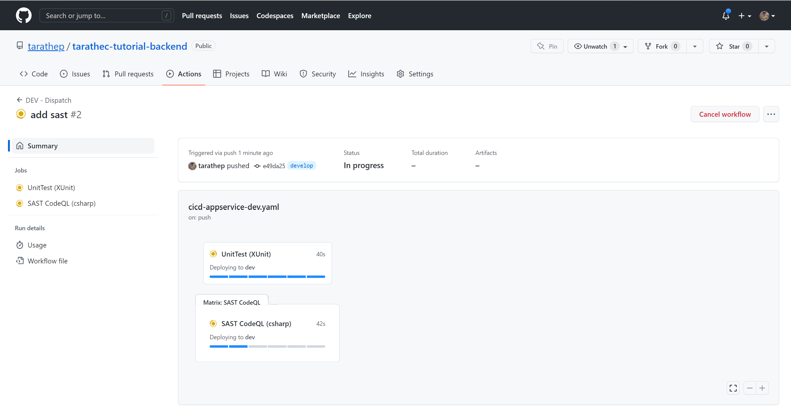

Review output in Security tab on top.

On Security overview click to enable on the first time.

- Enable vulnerability reporting
- Enable Dependabot alerts

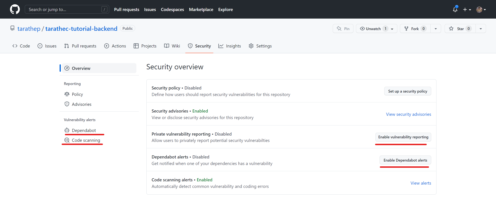

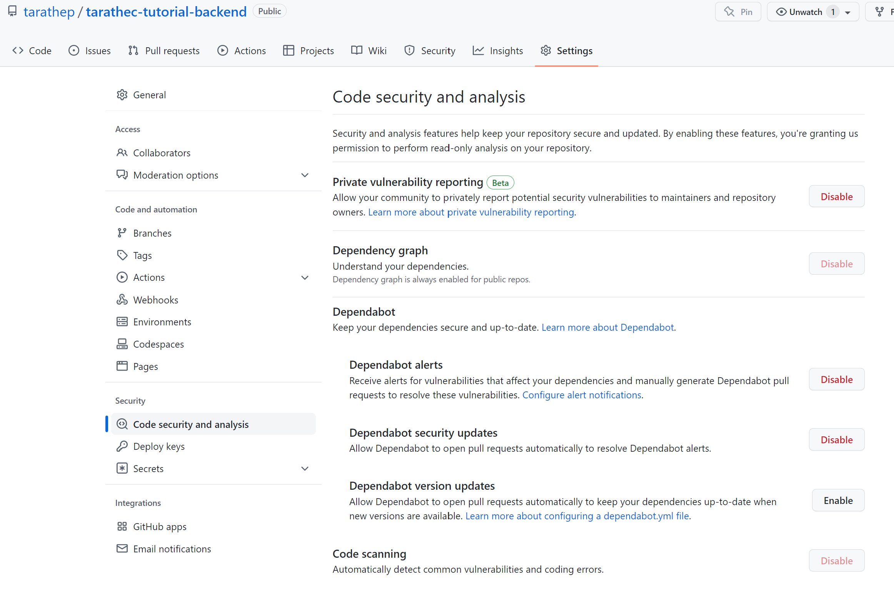

Go back to Security tab and go to output in left conner in **Vulnerability alerts**.

**Dependabot**

on *Denendabot* is active when upload source code in GitHub repository

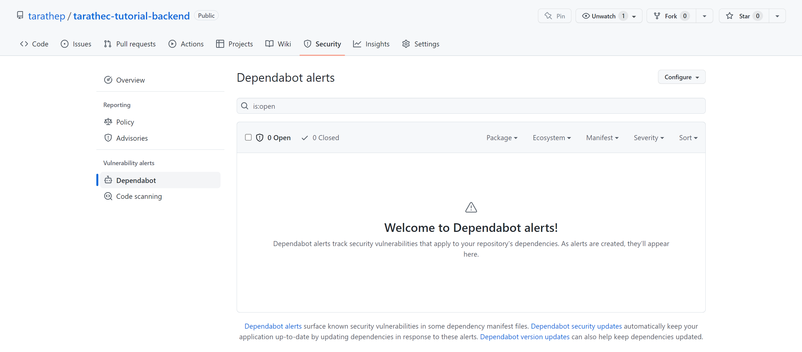

*Code scanning is active when running the SAST workflow.*

**Code scanning with CodeQL**

Code scanning is active when running the SAST workflow.

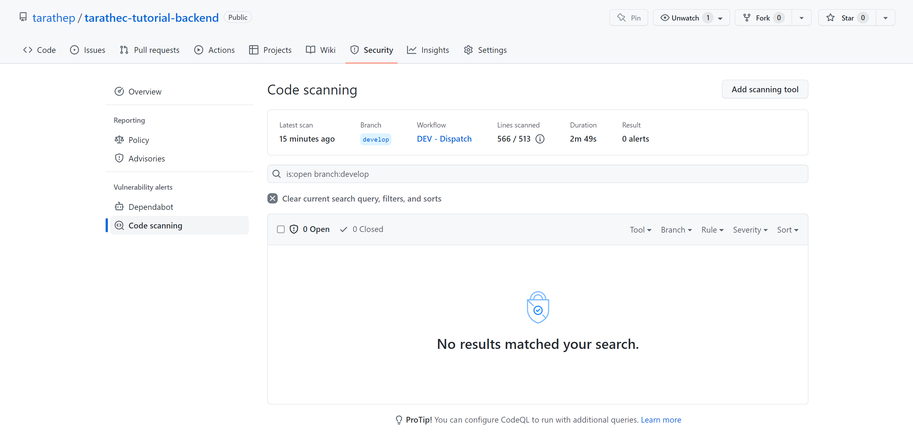

Summary Code

```yaml
name: DEV - Dispatch

on: 
  push:
    branches:    
      - develop
  workflow_dispatch:

jobs:
  unitest:
    name: UnitTest (XUnit)
    runs-on: ubuntu-latest
    environment:
      name: dev
    
    steps:
    - name: Checkout code
      uses: actions/checkout@v2

    - name: Setup .NET Core SDK
      uses: actions/setup-dotnet@v2.1.0
      with:
        dotnet-version: '6.0.x'

    - name: Install dependencies
      run: dotnet restore

    - name: Unit Test (XUnit)
      run: |
        dotnet test --collect:"XPlat Code Coverage"
        dotnet tool install -g dotnet-reportgenerator-globaltool
        reportgenerator -reports:"./XUnit.Tests/TestResults/*/coverage.cobertura.xml" -targetdir:"./coveragereport" -reporttypes:Html
    
    - name: Upload Reports
      uses: actions/upload-artifact@v2
      with:
        name: Unit Test Results
        path: '${{ github.workspace }}/coveragereport/*'

  analyze:
    name: SAST CodeQL
    runs-on: ubuntu-latest
    environment:
      name: dev
      url: https://github.com/<username>/<username>-tutorial-backend/security/code-scanning
    permissions:
      actions: read
      contents: read
      security-events: write

    strategy:
      fail-fast: false
      matrix:
        language: [ 'csharp' ]

    steps:
    - name: Checkout repository
      uses: actions/checkout@v2

    - name: Initialize CodeQL
      uses: github/codeql-action/init@v2
      with:
        languages: ${{ matrix.language }}
       
    - name: Autobuild
      uses: github/codeql-action/autobuild@v2


    - name: Perform CodeQL Analysis
      uses: github/codeql-action/analyze@v2

    # THIS IS INTERNAL ACITON ACCESS ONLY INTERNAL OGANIZAITON
    # - name: Quality Gate Check
    #   uses: corp-ais/quality-gate-action@main
    #   with:
    #     repository: corp-ais/<this-repos-name>
    #     severity: high
    #   env:
    #     GITHUB_TOKEN: ${{ secrets.WORKFLOW_TOKEN }}

```

Logging

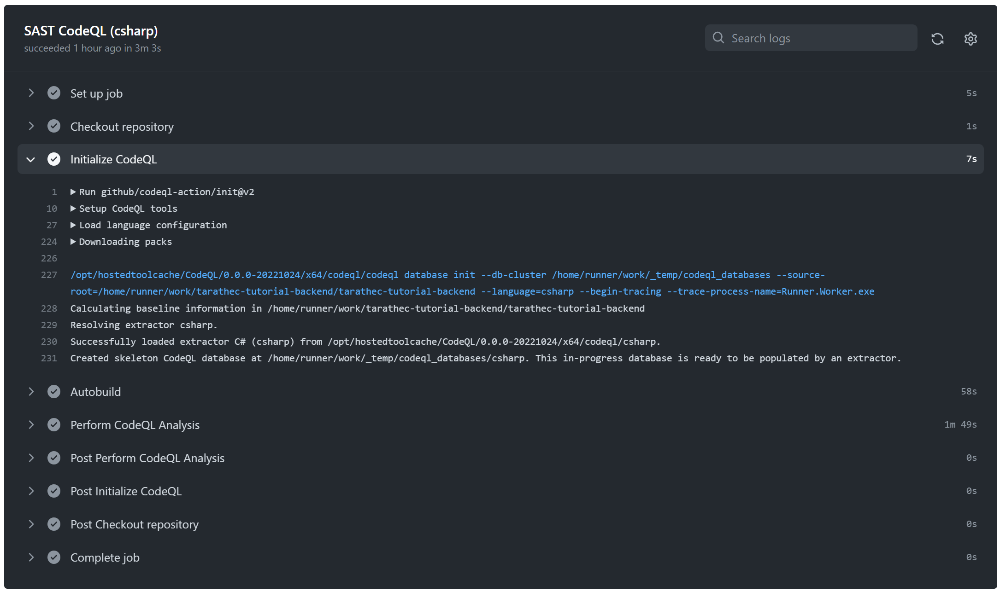

---

## Repository Dispatch

Go back to workspace on local and add new job

```yaml
 repo-dispatch:
    name: Repository Dispatch
    runs-on: ubuntu-latest
    needs: [unitest,analyze]
    environment:
      name: dev
      url: https://github.com/<username>/<username>-tutorial-backend/actions/workflows/dev-tutorial-backend-deploy.yml
```

**Steps**

```yaml
    steps:
    - name: Repository Dispatch
      uses: peter-evans/repository-dispatch@v1
      with:
        token: ${{ secrets.WORKFLOW_TOKEN }}
        repository: corp-ais/<username>-pipeline
        event-type: <username>-tutorial-backend-cd-dev
        client-payload: '{"ref": "${{ github.ref }}", "sha": "${{ github.sha }}"}'
```

in the **variable secrets** you must set env *Settings page > Environments > dev > Add secret* and enter personal token that have permission to allow access repository level.

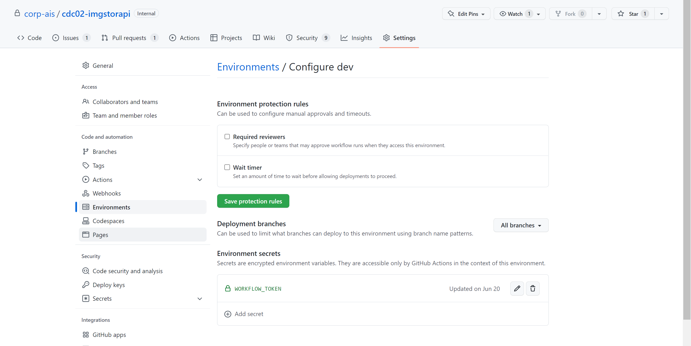

alternative you can use reference GITHUB_TOKEN to access and allow to add permission to repository CD.

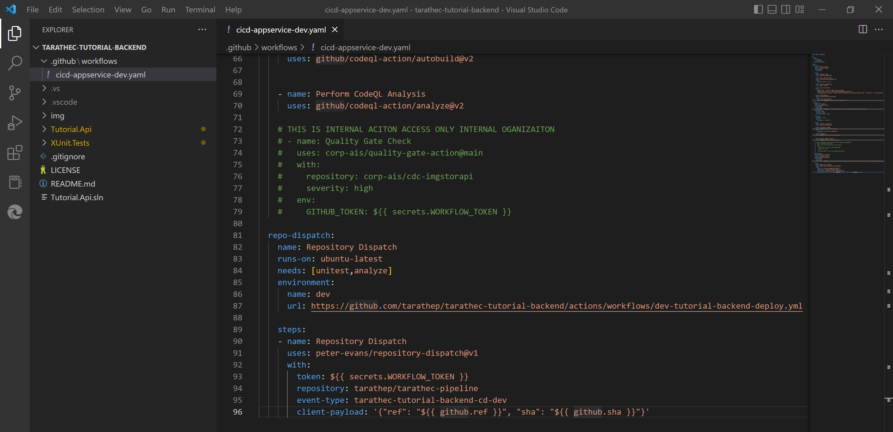

commit and push code to GitHub repository on branch develop

Review Output on GitHub Actions page

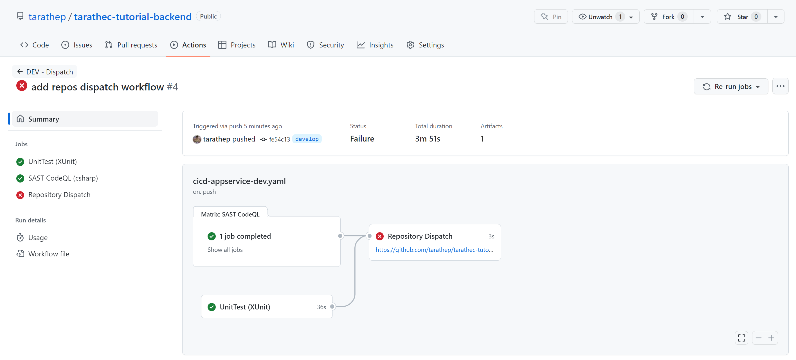

*Summary Code (Dev)*

```yaml
name: DEV - Dispatch

on: 
  push:
    branches:    
      - develop
  workflow_dispatch:

jobs:
  unitest:
    name: UnitTest (XUnit)
    runs-on: ubuntu-latest
    environment:
      name: dev
    
    steps:
    - name: Checkout code
      uses: actions/checkout@v2

    - name: Setup .NET Core SDK
      uses: actions/setup-dotnet@v2.1.0
      with:
        dotnet-version: '6.0.x'

    - name: Install dependencies
      run: dotnet restore

    - name: Unit Test (XUnit)
      run: |
        dotnet test --collect:"XPlat Code Coverage"
        dotnet tool install -g dotnet-reportgenerator-globaltool
        reportgenerator -reports:"./XUnit.Tests/TestResults/*/coverage.cobertura.xml" -targetdir:"./coveragereport" -reporttypes:Html
    
    - name: Upload Reports
      uses: actions/upload-artifact@v2
      with:
        name: Unit Test Results
        path: '${{ github.workspace }}/coveragereport/*'

  analyze:
    name: SAST CodeQL
    runs-on: ubuntu-latest
    environment:
      name: dev
      url: https://github.com/<username>/<username>-tutorial-backend/security/code-scanning
    permissions:
      actions: read
      contents: read
      security-events: write

    strategy:
      fail-fast: false
      matrix:
        language: [ 'csharp' ]

    steps:
    - name: Checkout repository
      uses: actions/checkout@v2

    - name: Initialize CodeQL
      uses: github/codeql-action/init@v2
      with:
        languages: ${{ matrix.language }}
       
    - name: Autobuild
      uses: github/codeql-action/autobuild@v2


    - name: Perform CodeQL Analysis
      uses: github/codeql-action/analyze@v2

    # THIS IS INTERNAL ACITON ACCESS ONLY INTERNAL OGANIZAITON
    # - name: Quality Gate Check
    #   uses: corp-ais/quality-gate-action@main
    #   with:
    #     repository: corp-ais/cdc-imgstorapi
    #     severity: high
    #   env:
    #     GITHUB_TOKEN: ${{ secrets.WORKFLOW_TOKEN }}

  repo-dispatch:
    name: Repository Dispatch
    runs-on: ubuntu-latest
    needs: [unitest,analyze]
    environment:
      name: dev
      url: https://github.com/<username>/<username>-tutorial-backend/actions/workflows/dev-tutorial-backend-deploy.yml

    steps:
    - name: Repository Dispatch
      uses: peter-evans/repository-dispatch@v1
      with:
        token: ${{ secrets.WORKFLOW_TOKEN }}
        repository: <username>/<username>-pipeline
        event-type: <username>-tutorial-backend-cd-dev
        client-payload: '{"ref": "${{ github.ref }}", "sha": "${{ github.sha }}"}'
```

*Logging*

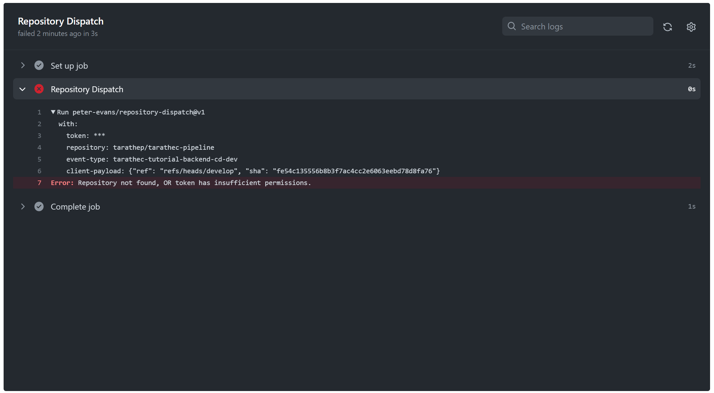

done merge code from branch develop to main .

---

## Create SIT workflows

On the ```SIT Build``` workflows is working on main branch and automate trigger by developer when tagging to GitHub repository.

<div align=center>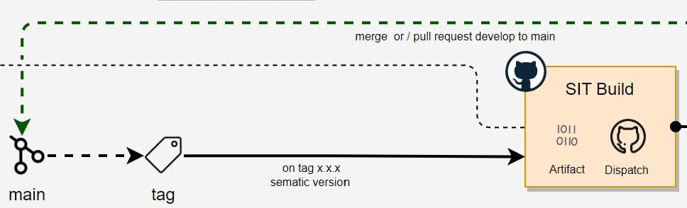</div>

Create the new file named ```cicd-appservice-sit.yaml``` inside ```.github/workflows``` this on the Workflows SIT which contains 1 workflow to build artifacts for prepare to deploy.


### Name

The first name starts with declare name of workflows

```yaml
name: SIT - Build
```

### On (Events that trigger workflows)

Enter events when do you want to execute or trigger the workflows

you can see more of event type at [Events that trigger workflows - GitHub Docs ](https://docs.github.com/en/actions/using-workflows/events-that-trigger-workflows)

```yaml
on:
  push:
    tags:
      - '*'
```

### Env

the environment global to declaration and variables


```yaml
env:
  ARTIFACT_NAME: "artifact-tutorial-backend"
```

### Jobs

Groups together all the jobs that run in the ```DEV - Dispatch``` workflow.

```yaml
jobs:
...
```

#### Build

The build artifact to contains in the job

```yaml
  build:
    runs-on: ubuntu-latest
    environment:
      name: sit
```

**Steps**

```yaml

    steps:
    - name: Checkout code
      uses: actions/checkout@v2

    - name: Set env
      if: startsWith(github.ref, 'refs/tags/')
      run: |
        echo "RELEASE_VERSION=${GITHUB_REF#refs/*/}" >> $GITHUB_ENV
    
    - name: Setup .NET Core SDK
      uses: actions/setup-dotnet@v2.1.0
      with:
        dotnet-version: '6.0.x'

    - name: Install dependencies
      run: dotnet restore

    - name: Build
      run: dotnet build --configuration Release --no-restore
    
    - name: Pack Artifact
      run: cd Tutorial.Api/bin/Release/net6.0 && tar -zcvf ${{ env.ARTIFACT_NAME }}-${{ env.RELEASE_VERSION }}.tar.gz *
      
    - name: Upload Artifact Release
      uses: softprops/action-gh-release@v1
      with:
        files: ${{ github.workspace }}/Tutorial.Api/bin/Release/net6.0/${{ env.ARTIFACT_NAME }}-${{ env.RELEASE_VERSION }}.tar.gz
```

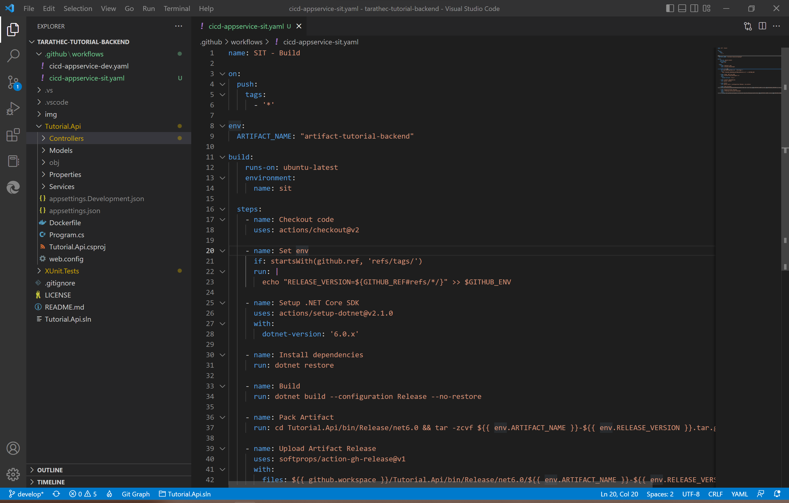

Commit and push code to GitHub repository on develop branch.

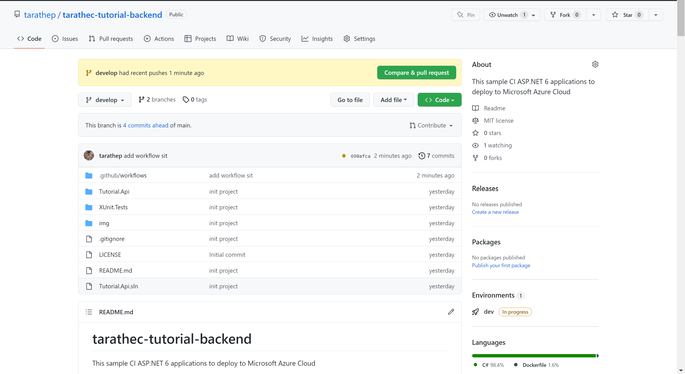

Before your merge develop branch to main branch you may set review and approve.

go to in the settings tab on top > in below ```Code and automation``` select ```Branches``` > click ```add branch protection rule``` 

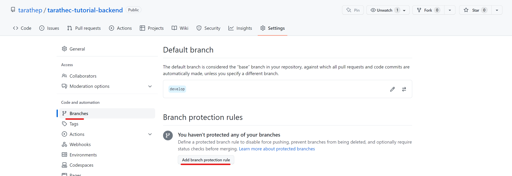

In Branch name pattern enter name: ```main``` and checked in below

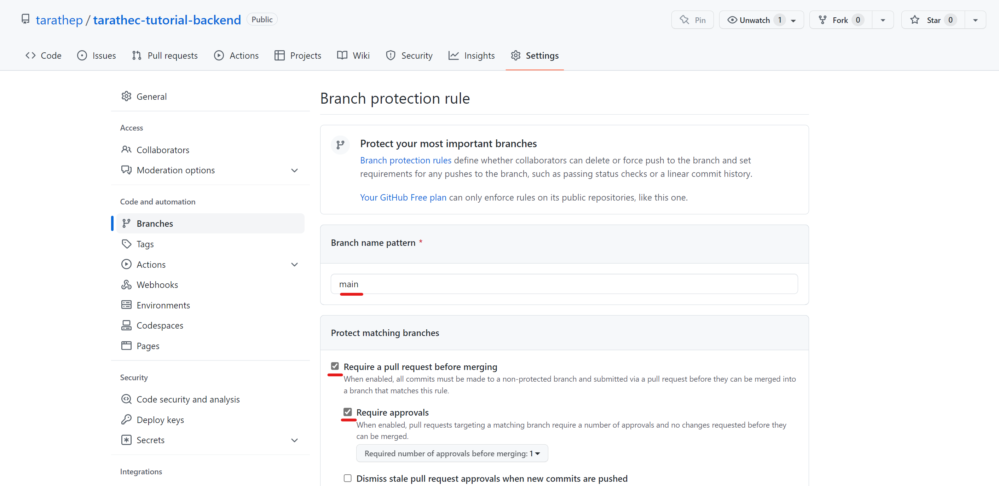


Go to *Pull requests* tab on top to merge branch from ```develop``` to ```main``` branch by click *New pull request* button

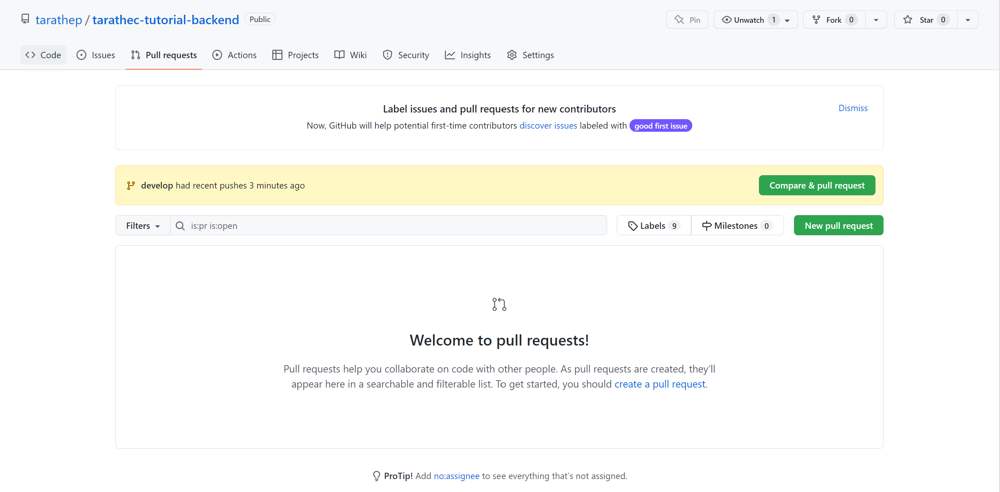


```Merge pull request```, you can see Error for merging is block because in this repository not working with others (assign yourself)

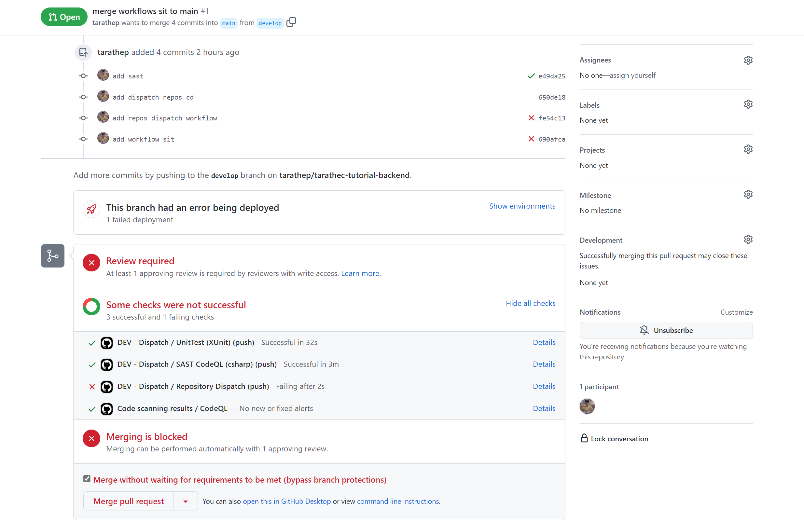

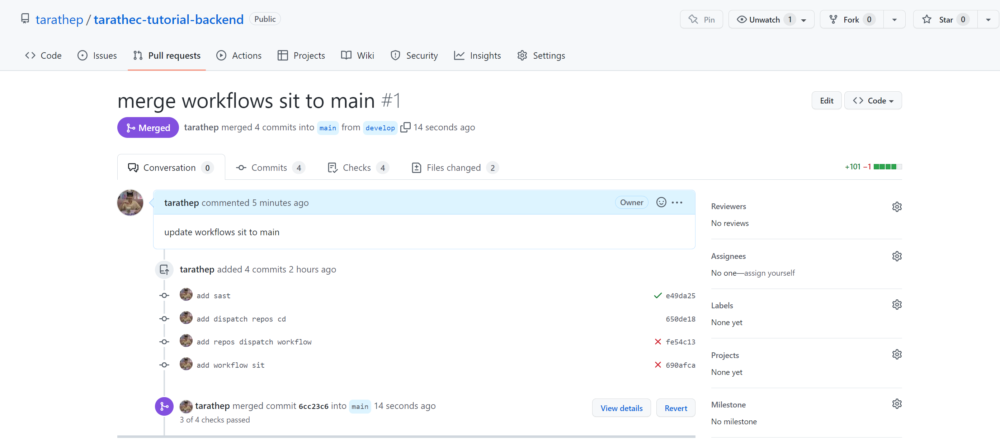

Go back to *Code* tab and create *release* to tags

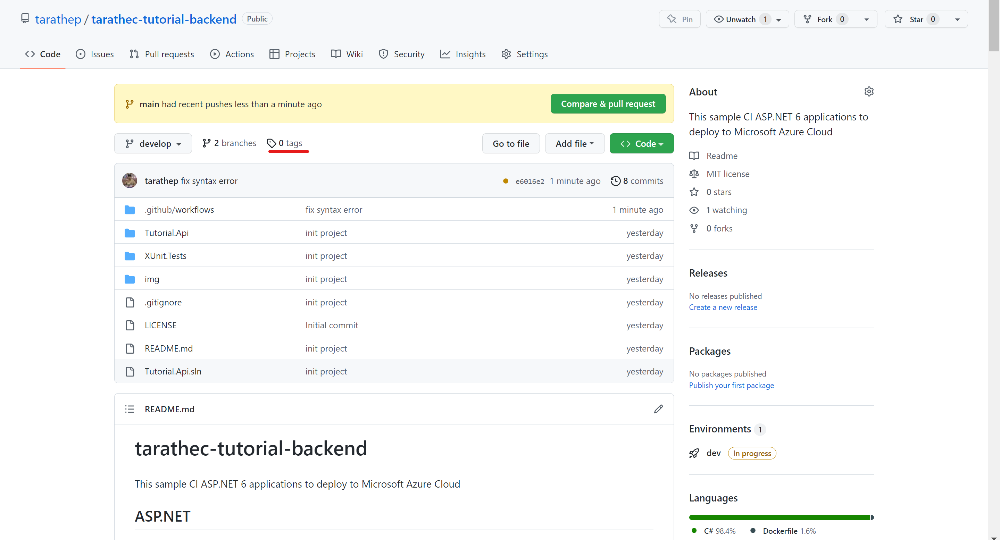

click ```Create a new release```

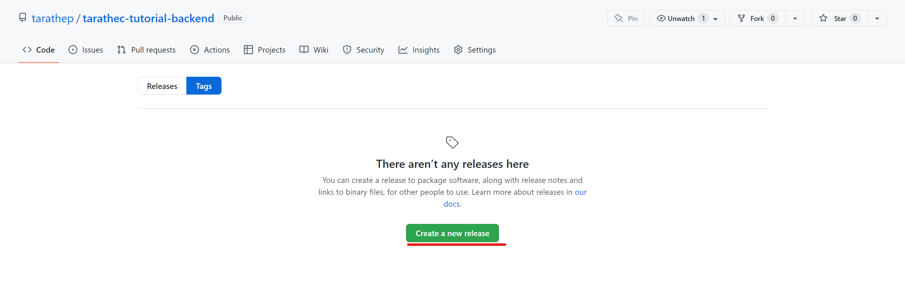

Choose a tag enter version following Tagging suggestions (Semantic versioning) and ```+Create new tag``` and Target at ```main``` branch


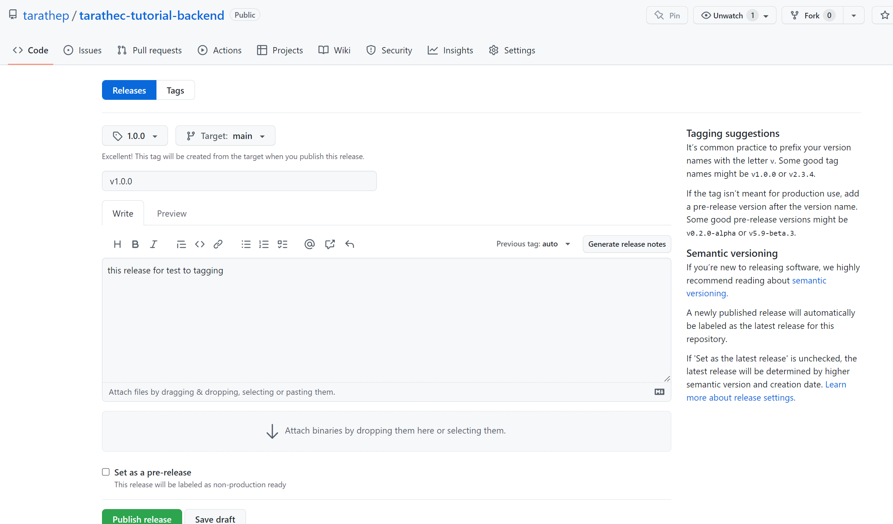

click Publish release and then go to the Actions tab in the actions page you can see ```DEV - Build``` workflow

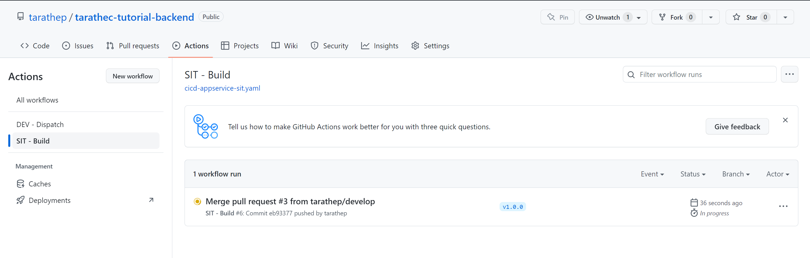

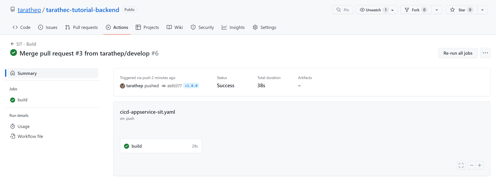

**Output the artifact**

go back to the Tags page

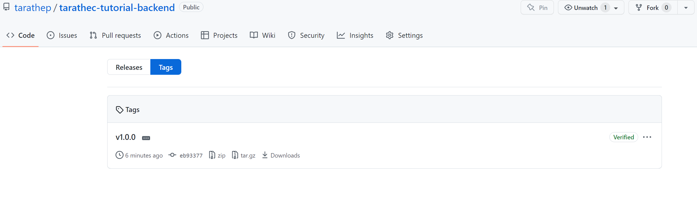

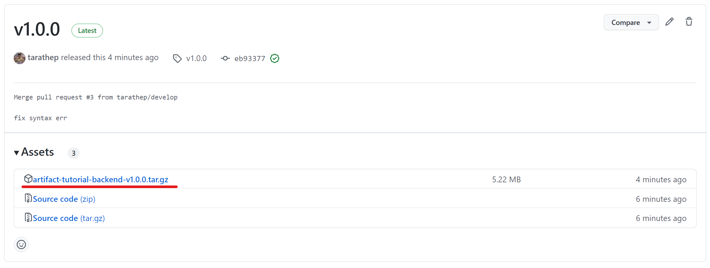

You can click to download to review.

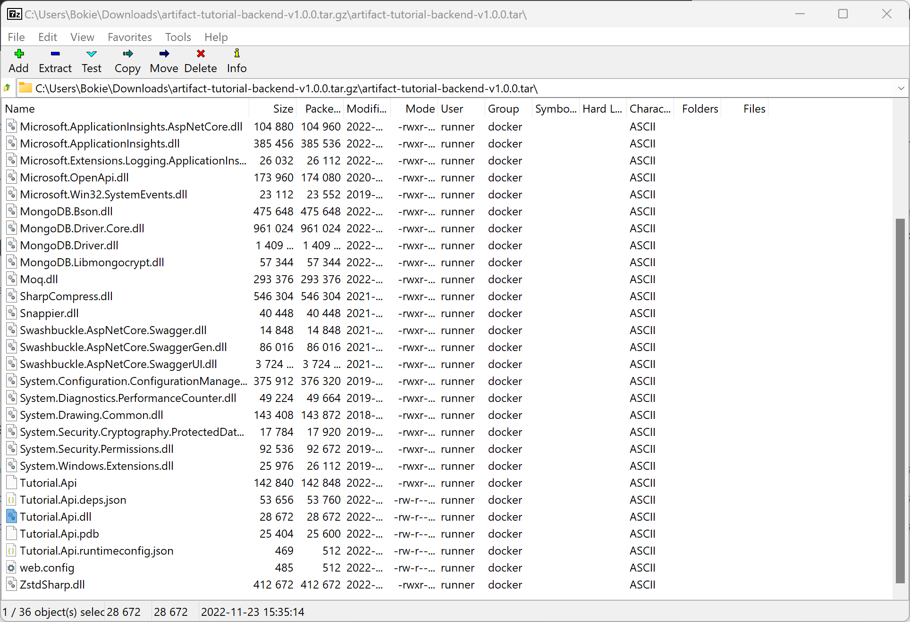

*Summary Code (SIT)*

```yaml
name: SIT - Build

on:
  push:
    tags:
      - '*'

env:
  ARTIFACT_NAME: "artifact-tutorial-backend"

jobs:
  build:
    runs-on: ubuntu-latest
    environment:
      name: sit

    steps:
    - name: Checkout code
      uses: actions/checkout@v2

    - name: Set env
      if: startsWith(github.ref, 'refs/tags/')
      run: |
        echo "RELEASE_VERSION=${GITHUB_REF#refs/*/}" >> $GITHUB_ENV
    
    - name: Setup .NET Core SDK
      uses: actions/setup-dotnet@v2.1.0
      with:
        dotnet-version: '6.0.x'

    - name: Install dependencies
      run: dotnet restore

    - name: Build
      run: dotnet build --configuration Release --no-restore
    
    - name: Pack Artifact
      run: cd Tutorial.Api/bin/Release/net6.0 && tar -zcvf ${{ env.ARTIFACT_NAME }}-${{ env.RELEASE_VERSION }}.tar.gz *
      
    - name: Upload Artifact Release
      uses: softprops/action-gh-release@v1
      with:
        files: ${{ github.workspace }}/Tutorial.Api/bin/Release/net6.0/${{ env.ARTIFACT_NAME }}-${{ env.RELEASE_VERSION }}.tar.gz
```

*logging*

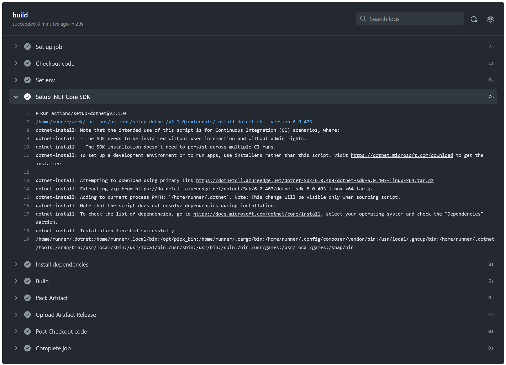


